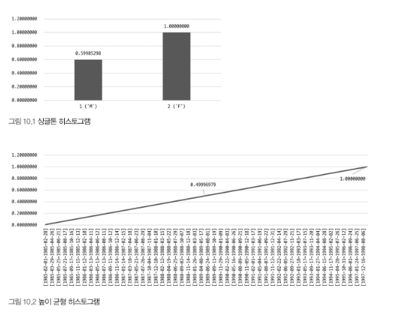
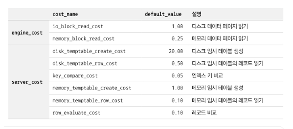

# 10.1 통계 정보

- 5.7 버전까지는 테이블, 인덱스에 대한 개괄적인 정보를 가지고 실행 계획 수립

- 8.0 버전 부터는 인덱스가 아닌 칼럼들에 대해 데이터 분포도를 수집하는 히스토그램 정보가 도입

## 1. 테이블 및 인덱스 통계 정보

- 5.6 이전 버전에는 비용 기반의 최적화를 사용했지만 통계 정보의 정확도가 낮고 휘발성 강함

- 그래서 실제 테이블의 데이터를 일부 분석해서 통계 정보를 보완해서 사용

## 1.1 MySQL 서버의 통계정보

- 5.6 이전 버전 부터는 테이블의 통계 정보가 메모리에만 관리돼서 서버가 재시작 되면 초기화
- 그래서 이후 버전 부터는 통계 정보를 영구적으로 관리
- **STATS_PERSISTENT** 라는 옵션을 통해 영구적으로 보관 여부를 테이블을 생성할 때 세팅 가능

    - STATS_PERSISTENT=0 : 통계 정보를 영구적으로 저장하지 않음

    - STATS_PERSISTENT=1 : 통계 정보를 innodb_index_stats와 innodb_table_stats에 저장

    - STATS_PERSISTENT=DEFAULT : 테이블을 생성할 떄 별도로 STATS_PERSISTENT 옵션을 설정하지 않은 것과 동일하며, 영구 관리 여부를 innodb_stats_persistent 시스템 변수의 값으로 결정

- innodb_stats_persistent 는 기본 값은 ON(1)로 설정

```sql
mysql> SELECT *
       FROM innodb_index_stats
       WHERE database_name=' employees
        AND TABLE_NAME=' employees';
```

| index\_name   | stat\_name     | stat\_value | sample\_size | stat\_description                 |
| ------------- | -------------- | ----------- | ------------ | --------------------------------- |
| PRIMARY       | n\_diff\_pfx01 | 299202      | 20           | emp\_no                           |
| PRIMARY       | n\_leaf\_pages | 886         | NULL         | Number of leaf pages in the index |
| PRIMARY       | size           | 929         | NULL         | Number of pages in the index      |
| ix\_firstname | n\_diff\_pfx01 | 1313        | 20           | first\_name                       |
| ix\_firstname | n\_diff\_pfx02 | 294900      | 20           | first\_name, emp\_no              |
| ix\_firstname | n\_leaf\_pages | 9           | NULL         | Number of leaf pages in the index |
| ix\_firstname | size           | 353         | NULL         | Number of pages in the index      |
| ix\_hiredate  | n\_diff\_pfx01 | 5128        | 20           | hire\_date                        |
| ix\_hiredate  | n\_diff\_pfx02 | 300869      | 20           | hire\_date, emp\_no               |
| ix\_hiredate  | n\_leaf\_pages | 231         | NULL         | Number of leaf pages in the index |
| ix\_hiredate  | size           | 289         | NULL         | Number of pages in the index      |

- innodb_index_stats.stat_name='n_diff_pfx%': 인덱스가 가진 유니크한 개수

- innodb_index_stats.stat_name='n_leaf_pages': 인덱스의 리프 노드 페이지 개수

- innodb_index_stats.stat_name='size': 인덱스 트리의 전체 페이지 개수

- innodb_index_stats.stat_name='n_rows': 테이블의 전체 레코드 건수


```sql
mysql > SELECT *
        FROM innodb_table_stats
        WHERE database_name=' employees'
         AND TABLE_NAME=' employees';    
```

| n\_rows | clustered\_index\_size | sum\_of\_other\_index\_sizes |
| ------- | ---------------------- | ---------------------------- |
| 299202  | 929                    | 642                          |

- innodb_index_stats.clustered_index_size: PK의 크기(InnoDB 페이지 개수)

- innodb_index_stats.sum_of_other_index_sizes: PK를 제외한 인덱스의 크기(InnoDB 페이지 개수)


### 통계 정보 갱신
- 통계 정보가 갱신되는 경우
  
  - 테이블이 새로 오픈되는 경우

  - 테이블의 레코드가 대량으로 변경되는 경우
    
    - 테이블의 전체 레코드 중에서 1/16 정도의 **UPDATE** or **INSERT** or **DELETE** 가 실행되는 경우
  
  - ANALYZE TABLE 명령이 실행되는 경우
  
  - **SHOW TABLE STATUS** 명령이나 **SHOW INDEX** 명령이 실행되는 경우
  
  - InnoDB 모니터가 활성화되는 경우
  
  - **innodb_stats_on_metadata** 시스템 설정이 ON인 상태에서 **SHOW TABLE STATUS** 명령이 실행되는 경우

- 통계 정보가 자주 갱신되면 같은 쿼리라도 어느 순간 성능이 엄청 떨어지는 경우가 생김

- **innodb_stats_auto_recalc** 시스템 설정 변수를 통해 자동 갱신이 되는 걸 막을 수 있음 (기본값 ON)

  - OFF로 해야 자동 갱신 X 
  
- 테이블 단위로 자동 수집을 적용 하려면 **STATS_AUTO_RECALC** 옵션을 사용

  - STATS_AUTO_RECAL = 1: 자동 수집(갱신) ON

  - STATS_AUTO_RECAL = 0: ANALYZE TABLE 명령을 실행할 때만 수집(갱신)

  - STATS_AUTO_RECAL = DEAFULT: 옵션을 설정하지 않은 것과 동일 innodb_stats_auto_recalc 시스템 설정 변수의 값으로 결정

### 통계 정보 수집 샘플링 방식

- innodb_stats_transient_sample_pages: 통게 정보 수집 시 8개 페이지만 임의로 샘플링 후 분석 및 활용 (기본값 8)

- innodb_stats_persistent_sample_pages: ANALYZE TABLE 명령이 실행되면 임의로 20개 페이지만 샘플링 후 영구적으로 저장 및 활용

- 시스템 변수를 너무 크게 설정하면 수집 시간이 길어짐

---

## 2. 히스토그램 
- 칼럼의 데이터 분포도를 의미

- 5.7 버전 까지의 통계 정보는 단순히 인덱스된 칼럼의 유니크한 값 개수 (정보 부족)

    - 실제 인덱스의 일부 페이지를 랜덤으로 가져와 참조 및 활용

- 8.0 버전 부터 사용


### 2.1 히스토그램 정보 수집 및 삭제

- 자동 수집이 아니라 **ANALYZE TABLE ... UPDATE HISTOGRAM** 명령을 통해 수동으로 수집 및 관리

- 정보는 칼럼 단위로 관리

- 수집된 정보는 **information_schema** DB의 **column_statistics** 테이블로 로드


```sql
ANALYZE TABLE employees
UPDATE HISTOGRAM ON gender, hire_date;

SELECT *
FROM COLUMN_STATISTICS
WHERE SCHEMA_NAME = 'employees'
  AND TABLE_NAME = 'employees'\G
  
{
  "data-type": "enum",
  "histogram-type": "singleton",
  "buckets": [
    [1, 0.5998529796789721],
    [2, 1.0]
  ],
  "null-values": 0.0,
  "collation-id": 45,
  "sampling-rate": 0.3477,
  "last-updated": "2020-08-03 03:47:45"
}

{
  "data-type": "date",
  "histogram-type": "equi-height",
  "buckets": [
    ["1985-02-01", "1985-02-28", 0.0098, 28],
    ["1985-03-01", "1985-03-28", 0.0201, 28],
    ...
    ["1998-08-07", "2000-01-06", 1.0, 420]
  ],
  "null-values": 0.0,
  "collation-id": 8,
  "sampling-rate": 0.3477,
  "number-of-buckets-specified": 100,
  "last-updated": "2020-08-03 03:47:45"
}

```

- 히스토그램 정보

  - 타입 
  
    - Singleton: 칼럼 값 개별로 레코드 건수를 관리하는 히스토그램. 도수 분포라고 불림
  
      - 버킷의 형태: **[값, 빈도 수]**
  
    - Equi-Height: 칼럼값의 범위를 균등한 개수로 구분해서 관리하는 히스토그램. Height-Balanced 히스토그램이라고 불림

      - 버킷의 형태: **[시작 범위, 끝 범위, 빈도 수, 유니크한 값 개수]**

  - 공통

    - sampling-rate: 히스토그램 정보를 수집하기 위해 스캔한 페이지 비율
      
      - **histogram_generation_max_mem_size** 값에 맞춰 샘플링
    
    - histogram_type: 히스토그램의 타입
    
    - number-of-buckets-specified: 히스토그램을 생성할 때 설정한 버킷의 개수 (최대 1024개 설정 가능 일반적으로 100개면 충분(?))


  


- 삭제
```sql
mysql> ANALYZE TABLE employees. employees
DROP HISTOGRAM ON gender, hire_date;
```

- 미사용 (글로벌)
```sql
mysql> SET GLOBAL optimizer_switch='condition_fanout_filter=off';
```

- 특정 커넥션 또는 특정 쿼리 미사용
```sql
-- // 커넥션 단위
mysql> SET SESSION optimizer_switch='condition_fanout_filter=off";

-- // 쿼리 단위
mysql > SELECT /*+ SET_VAR(optimizer_switch='condition_fanout_filter=off') */ *
FROM . . .
```

- 미사용 하거나 삭제하면 사용했을 때와 성능 차이가 존재

---

## 2.2 히스토그램의 용도

- 데이터는 항상 균등한 분포를 갖고 있지 않음

- 따라서 히스토그램 도입 전 통계(테이블 전체 레코드 건수 + 인덱스를 구성하는 칼럼의 유니크 값 개수)은 분포를 알 수 없음

- **히스토그램**은 데이터의 분포 정보기 때문에 **실행 계획**에 대한 정확한 예측 가능

- **히스토그램**이 없다면 옵티마이저는 데이터가 균등하게 분포돼 있다고 인식 **BUT** 히스토그램이 있으면 특정 범위의 데이터의 적고 많음을 인식

---

## 2.3 히스토그램과 인덱스

- MySQL 서버에서 실행 계획을 수립할 때 조건절에 따라 사용가능한 인덱스들로부터 레코드 건수를 대략 파악 후 가장 괜찮은(?) 계획을 수립
  
  - 이 과정을 실제 인덱스의 B-Tree를 샘플링 하는데 이것을 인덱스 다이브(Index Dive)라고 칭함

- **인덱스**를 검색 조건으로 사용할 수 있고 실제 사용하게 되면 **히스토그램** 정보는 사용하지 않음

- **히스토그램**은 인덱싱 되지 않은 컬럼에 대한 분포를 참조하는 용도로 사용

## 3. 코스트 모델
- 쿼리의 비용을 계산하는 데 필요한 단위 작업들의 비용을 의미

- 쿼리 처리할 때 필요한 작업

    - 디스크로부터 데이터 페이지 읽기

    - 메모리(InnoDB 버퍼 풀)로 부터 데이터 페이지 읽기
    
    - 인덱스 키 비교
    
    - 레코드 평가
    
    - 메모리 임시 테이블 작업
      
    - 디스크 임시 테이블 작업

- 5.7 이전 버전까지는 상수화해서 사용

- 하지만 하드웨어에 따라 비용이 달라질 수 있어서 관리자가 조정할 수 있게 개선


### 코스트 모델 테이블

- server_cost: 인덱스를 찾고 레코드를 비교하고 임시 테이블 처리에 대한 비용 관리

- engine_cost: 레코드를 가진 데이터 페이지를 가져오는 데 필요한 비용 관리

### 컬럼 정보

- 공통

    - cost_name: 코스트 모델의 각 단위 작업

    - default_value: 각 단위 작업의 비용(MySQL 서버 소스코드에 설정된 값으로 기본값 세팅)

    - cost_value: DBMS 관리자가 설정한 값(NULL이면 default_value 값 사용)

    - last_updated: 단위 작업의 비용이 변경된 시점

    - comment: 비용에 대한 설명

- engine_cost 추가

    - engine_name: 비용이 적용된 스토리지 엔진

        - MEMORY, MyISAM, InnoDB 엔진에 대한 설정을 할 수 있음
    
    - device_type: 디스크 타입

        - 사용 안함




- row_evaluate_cost: 스토리지 엔진이 반환한 레코드가 쿼리의 조건에 일치하는지 평가하는 작업

    - 클수록 풀 테이블 스캔의 쿼리 비용 증가, 래인지 스캔의 비용 감소

- key_compare_cost: 키 값의 비교 작업에 필요한 비용

    - 클수록 정렬 비용 증가


- 비용은 EXPLAIN 쿼리로 알 수 있음


### 코스트 모델의 이해

- key_compare_cost 비용을 높이면 옵티마이저는 정렬을 수행하지 않는 방향의 실행 계획을 선택할 가능성 증가

- row_evaluate_cost 비용을 높이면 래인지 스캔을 사용하는 계획을 선택할 가능성 증가
  
- disk_temptable_create_cost, disk_temptable_row_cost 비용을 높이면 디스크에 임시 테이블을 만들지 않는 실행 계획 선택 가능성 증가

- memory_temptable_create_cost, memory_temptable_row_cost 비용을 높이면 메모리에 임시 테이블을 만들지 않는 실행 계획 선택 가능성 증가

- io_block_read_cost 비용이 높아지면 InnoDB 버퍼 풀에 데이터 페이지가 많이 적재돼 있는 인덱스를 사용하는 실행 계획 선택 가능성 증가

- memory_block_read_cost 비용이 높아지면 InnoDB 버퍼 풀에 적재된 데이터 페이지가 적더라도 그 인덱스를 사용할 가능성 증가
