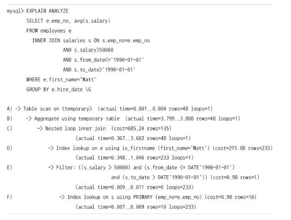

# 10.2 실행 계획 확인

## 1. 실행 계획 출력 포맷
- 테이블 포맷

```mysql
mysql> EXPLAIN
       SELECT *
       FROM employees e
        INNER JOIN salaries s ON s.emp_no=e. emp_no
       WHERE first_name=*ABC';

```

| id | select\_type | table | type | possible\_keys        | key           | key\_len | ref       | rows | filtered | Extra       |
| -- | ------------ | ----- | ---- | --------------------- | ------------- | -------- | --------- | ---- | -------- | ----------- |
| 1  | SIMPLE       | e     | ref  | PRIMARY,ix\_firstname | ix\_firstname | 58       | const     | 1    | 100.00   | Using index |
| 1  | SIMPLE       | s     | ref  | PRIMARY               | PRIMARY       | 4        | e.emp\_no | 10   | 100.60   | NULL        |

---

- 트리 포맷

```sql
mysql> EXPLAIN FORMAT=TREE
       SELECT *
       FROM employees e
        INNER JOIN salaries s ON s.emp_no=e.emp_no
       WHERE first_name='ABC' \G


EXPLAIN:
-> Nested loop inner join  (cost=2.40 rows=10)
   -> Index lookup on e using ix_firstname (first_name='ABC')  (cost=0.35 rows=1)
   -> Index lookup on s using PRIMARY (emp_no=e.emp_no)        (cost=2.05 rows=10)

```

- JSON 포맷

```sql
mysql> EXPLAIN FORMAT=JSON
       SELECT *
       FROM employees e
        INNER JOIN s a l a r i e s s ON s.emp_no=e. emp_no
       WHERE first_name='ABC'\G
```
```json
{
  "query_block": {
    "select_id": 1,
    "cost_info": {
      "query_cost": "2.40"
    },
    "nested_loop": [
      {
        "table": {
          "table_name": "e",
          "access_type": "ref",
          "possible_keys": ["PRIMARY", "ix_firstname"],
          "key": "ix_firstname",
          "used_key_parts": ["first_name"]
        }
      },
      {
        "table": {
          "table_name": "s",
          "access_type": "ref",
          "possible_keys": ["PRIMARY"],
          "key": "PRIMARY",
          "used_key_parts": ["emp_no"]
        }
      }
    ]
  }
}

```
## 2. 쿼리의 실행 시간 확인
- **EXPLAIN** 단순 계획 확인
- **EXPLAIN ANALYZE**는 단계별로 소요된 시간 정보 노출



- **SHOW PROFILE** 쿼리의 실행 단계별 소요시간을 알려줌 실행계획은 -> 알 수 없음
```sql
| Status               | Duration |
| -------------------- | -------- |
| starting             | 0.000112 |
| checking permissions | 0.000003 |
| Opening tables       | 0.000015 |
| System lock          | 0.000005 |
| optimizing           | 0.000010 |
| statistics           | 0.000020 |
| preparing            | 0.000008 |
| executing            | 0.000002 |
| Sending data         | 0.000245 |
| end                  | 0.000003 |
| query end            | 0.000002 |
| closing tables       | 0.000005 |
| freeing items        | 0.000008 |
| cleaning up          | 0.000003 |

```
- 실행 순서 기준

    - 들여쓰기가 같은 레벨에서는 상단에 위치한 라인이 먼저 실행

    - 들여쓰기가 다른 레벨에서는 가장 안쪽에 위치한 라인이 먼저 실행

- D > F > E > C > B > A

- 각 필드의 의미 **(actual time=0.007..0.009 rows=10 loops=233)**

    - actual time=0.007..0.009: emp_no 기준으로 salaries 테이블에서 레코드를 검색하는데 걸리는 시간
      - 첫 번쨰 숫자는 첫 레코드, 두 번쨰 숫ㅈ자는 마지막 레코드 조회 하는데 걸린 시간

    - rows=10: 테이블에서 읽은 emp_no에 일치하는 salaries 테이블의 평균 레코드 건수

    - loops=233: employees 테이블에서 읽은 emp_no를 이용해 salaries 테이블의 레코드를 차즌 작업이 반복된 횟수
      - emp_no의 개수와 동일 => 233개


- **EXPLAIN ANALYZE**는 실제 쿼리를 실행 해보고 소요 시간을 알려주기 떄문에 성능이 많이 느린 쿼리라면 **EXPLAIN**으로 실행 계획 파악 및 어느정도 튜닝 후 **EXPLAIN ANALYZE** 를 사용하는 것을 권장
