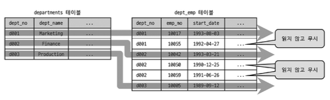
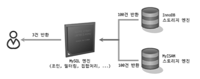

# 10.3 실행 계획 분석
- 어떤 접근 방법을 사용해서 최적화를 수행하는지
- 어떤 인덱스를 사용하는지

```sql
EXPLAIN
SELECT *
FROM employees e
INNER JOIN salaries s ON s.emp_no = e.emp_no
WHERE first_name = 'ABC';

+----+-------------+-------+------------+------+---------------------+--------------+---------+---------------------+------+----------+-------+
| id | select_type | table | partitions | type | possible_keys       | key          | key_len | ref                 | rows | filtered | Extra |
+----+-------------+-------+------------+------+---------------------+--------------+---------+---------------------+------+----------+-------+
|  1 | SIMPLE      | e     | NULL       | ref  | PRIMARY,ix_firstname| ix_firstname | 58      | const               |    1 |   100.00 | NULL  |
|  1 | SIMPLE      | s     | NULL       | ref  | PRIMARY             | PRIMARY      | 4       | employees.e.emp_no  |   10 |   100.00 | NULL  |
+----+-------------+-------+------------+------+---------------------+--------------+---------+---------------------+------+----------+-------+
```

- 표의 각 라인은 **쿼리 문장**에서 사용된 테이블 개수만큼 출력
- 실행 순서는 위에서 아래로 순서대로 표시 (union 이나 상관 서브쿼리는 아닐수도)

## 10.3.1 id 칼럼

- 하나의 select 안에 여러 개의 테이블을 조인하면 조인되는 테이블의 개수만큼 레코드
  - 하지만 동일한 id 로 표시

- id 칼럼은 테이블의 접근 순서를 의미하지 않는다
```sql
EXPLAIN FORMAT=TREE
SELECT *
FROM dept_emp de
WHERE de.emp_no = (
    SELECT e.emp_no
    FROM employees e
    WHERE e.first_name = 'Georgi'
      AND e.last_name = 'Facello'
    LIMIT 1
);

+----+-------------+-------+------+---------------------+------+-------------+
| id | select_type | table | type | key                 | rows | Extra       |
+----+-------------+-------+------+---------------------+------+-------------+
|  1 | PRIMARY      | de    | ref  | ix_empno_fromdate   | 1    | Using where|
|  2 | SUBQUERY     | e     | ref  | ix_firstname        | 253  | Using where|
+----+-------------+-------+------+---------------------+------+-------------+
```

## 10.3.2 select_type 칼럼
- 각 단위 SELECT 쿼리가 어떤 타입의 쿼리인지 표시

### SIMPLE
- 단순 SELECT 쿼리
- 쿼리가 복잡해도 단 하나만 존재
- 일반적으로 제일 바깥 SELECT

### PRIMARY
- UNION 이나 서브쿼리가 존재하는 SELECT
- 가장 바깥 OUTER 쿼리
- 단 하나만 존재

### UNION
- UNION으로 결합하는 단위 SELECT 쿼리 가운데 첫 번째를 제외한 두 번째 이후 단위 SELECT 쿼리
- 첫번째는 DERIVED
```sql
EXPLAIN
SELECT * FROM (
  (SELECT emp_no FROM employees e1 LIMIT 10)
  UNION ALL
  (SELECT emp_no FROM employees e2 LIMIT 10)
  UNION ALL
  (SELECT emp_no FROM employees e3 LIMIT 10)
) tb;

+----+-------------+------------+-------+-------------+------+--------+-------------+
| id | select_type | table      | type  | key         | ref  | rows   | Extra       |
+----+-------------+------------+-------+-------------+------+--------+-------------+
|  1 | PRIMARY     | <derived2> | ALL   | NULL        | NULL |     30 | NULL        |
|  2 | DERIVED     | e1         | index | ix_hiredate | NULL | 300252 | Using index |
|  3 | UNION       | e2         | index | ix_hiredate | NULL | 300252 | Using index |
|  4 | UNION       | e3         | index | ix_hiredate | NULL | 300252 | Using index |
+----+-------------+------------+-------+-------------+------+--------+-------------+
```
### DEPENDENT UNION
- DEPENDENT 는 UNION이나 UNION ALL로 결합된 단위 쿼리가 외부 쿼리에 영향을 받는 것
```sql
mysql> EXPLAIN
    SELECT *
    FROM employees e1 WHERE e1.emp_no IN (
    SELECT e2.emp_no FROM employees e2 WHERE e2.first_name='Matt'
    UNION
    SELECT e3.emp_no FROM employees e3 WHERE e3.last_name='Matt'
);
```
- in에서 e2.emp_no=e1.emp_no, e3.emp_no=e1.emp_no 조건이 자동 추가
### UNION RESULT
- UNION 결과를 담아두는 테이블(임시)
- UNION ALL 은 현재 임시 테이블 사용 X
- 단위 쿼리가 아니기 때문에 id 부여 X

### SUBQUERY
- FROM 절 이외에서 사용되는 서브쿼리를 의미
- FROM 절에 사용된 서브쿼리는 DERIVED
- DERIVED = 파생 테이블

**서브 쿼리의 다른 이름**
```
- Nested Query: SELECT 되는 컬럼에 사용된 서브 쿼리
- Subquery: WHERE 절에 사용되는 일반적인 서브 쿼리
- Derived Table: FROM 절에 사용된 서브 쿼리
```

### DEPENDENT SUBQUERY
- 서브쿼리가 Outer SELECT 쿼리에 정의된 칼럼을 사용
```sql
mysql> EXPLAIN
    SELECT e.first_name,
        (SELECT COUNT(*)
        FROM dept_emp de, dept_manager dm
        WHERE dm.dept_no=de.dept_no AND de.emp_no=e.emp_no) AS cnt
        FROM employees e
    WHERE e.first_name='Matt';
```
- 서브 쿼리의 결과가 Outer SELECT에 의존
### DERIVED
- 단위 SELCT 쿼리의 실행 결과로 메모리나 디스크에 임시 테이블 생성 의미
- 임시 테이블 = 파생 테이블
- 인덱스 없어 느리다

```
❗️서브 쿼리 보다는 조인을 사용 것을 권장
```

### DEPENDENT DERIVED
- FROM 절의 서브쿼리가 외부 컬럼 사용
- 8.0 부터 래터럴 조인 기능이 추가되면서 가능

### UNCACHEABLE SUBQUER
- 하나의 문장에서 서브쿼리가 하나만 있더라도 한 번만 실행되는 것은 아니다
- SUBQUERY는 바깥쪽(Outer)의 영향을 받지 않으므로 처음 한 번만 실행해서 그 결과를 캐시하고 필요할 때 캐시
된 결과를 이용
- DEPENDENT SUBQUERY는 의존하는 바깥쪽(Outer) 쿼리의 칼럼의 값 단위로 캐시해두고 사용

UNCACHEABLE 로 표시되는 경우
- 사용자 변수가 서브쿼리에 사용된 경우
- NOT-DETERMINISTIC 속성의 스토어드 루틴이 서브쿼리 내에 사용된 경우
- UUID()나 RAND()와 같이 결괏값이 호출할 때마다 달라지는 함수가 서브쿼리에 사용된 경우

### UNCACHEABLE UNION

- UNION + UNCACHEABLE

### MATERIALIZED
- 주로 FROM 절이나 IN(subquery) 형태의 쿼리에 사용된 서브쿼리 최적화 위해 사용
```sql
mysql> EXPLAIN
    SELECT *
    FROM employees e
    WHERE e.emp_no IN (SELECT emp_no FROM salaries WHERE salary BETWEEN 100 AND 1000);
```
- 서브 쿼리 내용을 테이블로 구체화(MATERIALIZED) 후 임시 테이블과 employees 조인

## 10.3.4 테이블 칼럼
- MySQL 서버의 실행 계획은 단위 SELECT 기준이 아니라 테이블 기준

```sql
mysql> EXPLAIN SELECT NOW();
mysql> EXPLAIN SELECT NOW() FROM DUAL;

+----+-------------+-------+------+---------+----------------+
| id | select_type | table | key  | key_len | Extra          |
+----+-------------+-------+------+---------+----------------+
|  1 | SIMPLE      | NULL  | NULL | NULL    | No tables used |
+----+-------------+-------+------+---------+----------------+

```

```sql
+----+-------------+------------+--------+-------------------+--------+-------------+
| id | select_type | table      | type   | key               | rows   | Extra       |
+----+-------------+------------+--------+-------------------+--------+-------------+
|  1 | PRIMARY     | <derived2> | ALL    | NULL              | 331143 | NULL        |
|  1 | PRIMARY     | e          | eq_ref | PRIMARY           | 1      | NULL        |
|  2 | DERIVED     | de         | index  | ix_empno_fromdate | 331143 | Using index |
+----+-------------+------------+--------+-------------------+--------+-------------+
```
- <drived2> 형식으로 <> 안데 명시된 경우 임시 테이블, 숫자는 id 의미
- select_type MATERIALIZED 인 실행 계획에서 <subquery N>은 서비쿼리의 결과를 구체화 후 임시 테이블

## 10.3.4 partitions 칼럼

``` sql
mysql> CREATE TABLE employees_2 (
    emp_no int NOT NULL,
    birth_date DATE NOT NULL,
    first_name VARCHAR(14) NOT NULL,
    last_name VARCHAR(16) NOT NULL,
    gender ENUM('M','F') NOT NULL,
    hire_date DATE NOT NULL,
    PRIMARY KEY (emp_no, hire_date)
    ) PARTITION BY RANGE COLUMNS(hire_date)
    (PARTITION p1986_1990 VALUES LESS THAN ('1990-01-01'),
    PARTITION p1991_1995 VALUES LESS THAN ('1996-01-01'),
    PARTITION p1996_2000 VALUES LESS THAN ('2000-01-01'),
    PARTITION p2001_2005 VALUES LESS THAN ('2006-01-01'));

EXPLAIN
SELECT *
FROM employees_2
WHERE hire_date BETWEEN '1999-11-15' AND '2000-01-15';

+----+-------------+-------------+------------------------------+------+--------+
| id | select_type | table       | partitions                   | type | rows   |
+----+-------------+-------------+------------------------------+------+--------+
|  1 | SIMPLE      | employees_2 | p1996_2000,p2001_2005        | ALL  | 21743  |
+----+-------------+-------------+------------------------------+------+--------+
```

- 파티션은 물리적으로 개별 테이블처럼 별도의 저장 공간을 가짐
  
## 10.3.5 type 칼럼
- 각 테이블의 레코드를 읽는 방식 (테이블 접근 방식)

- system
- const
- eq_ref
- ref
- fulltext
- ref_or_null
- unique_subquery
- index_subquery
- range
- index_merge
- index
- ALL

**All을 제외한 나머지는 모두 인덱스를 사용하는 접근 방법**

### system
- 레코드가 1건만 존재하는 테이븍ㄹ 또는 한 건도 존재하지 않는 테이블을 참조
- MyISAM 이나 MEMORY 테이블에서만

### const
- 프라이머리 키나 유니크 키 칼럼을 이용하는 WHERE 조건절을 가지고 반드시 1건만 처리
- SCAN 전에 1건만 존재한다는 것을 알고 있어야 한다
- const 라고 표시 되는 이유는 최적화 단계에서 상수화 한다
  - 옵티마이저에 의해 상수화된 다음 쿼리 실행기로 전달

### eq_ref
- 조인에서 두 번째 이후에 읽는 테이블에서 반드시 1건만 존재한다는 보장이 있어야 하는 접근 방법
  
```sql
EXPLAIN
SELECT * 
FROM dept_emp de, employees e
WHERE e.emp_no = de.emp_no
  AND de.dept_no = 'd005';

+----+-------------+-------+--------+---------+---------+--------+
| id | select_type | table | type   | key     | key_len | rows   |
+----+-------------+-------+--------+---------+---------+--------+
|  1 | SIMPLE      | de    | ref    | PRIMARY | 16      | 165571 |
|  1 | SIMPLE      | e     | eq_ref | PRIMARY | 4       | 1      |
+----+-------------+-------+--------+---------+---------+--------+
```
- e.emp_no = de.emp_no 부분으로 한건만 존재한다는 것을 알 수 있다

### ref

- 인덱스 종류와 상관없이 동등 조건으로 검색
```sql
mysql> EXPLAIN
    SELECT * FROM dept_emp WHERE dept_no = 'd005';

+----+-------------+----------+------+---------+---------+-------+
| id | select_type | table    | type | key     | key_len | ref   |
+----+-------------+----------+------+---------+---------+-------+
|  1 | SIMPLE      | dept_emp | ref  | PRIMARY | 16      | const |
+----+-------------+----------+------+---------+---------+-------+
```

### fulltext

- 전문 검색 인덱스 사용
- 우선 순위가 상당히 높다
- 하지만 단순 range 가 빠를 때도 있어서 조건별 성능 확인이 필요하다

### ref_or_null
```sql
mysql> EXPLAIN
    SELECT * FROM titles
    WHERE to_date='1985-03-01' OR to_date IS NULL;
```

### unique_subquery

- WHERE 조건절에서 사용될 수 있는 IN 형태의 쿼리를 위한
- 서브쿼리에서 중복되지 않는 유니크한 값만 반환
 
```sql
mysql> EXPLAIN
    SELECT * FROM departments
    WHERE dept_no IN (SELECT dept_no FROM dept_emp WHERE emp_no=10001);
```

- 지금은 세미 조인 최적화 등으로 표현 될 수 있다

### index_subquery
- IN 에서 subquery 가 중복된 값을 반환 할 수 있고 인덱스를 이용해 중복을 제거 할 수 있을 때

### range
- 인덱스 range scan
- 우선 순위가 낮지만 상당히 빠르다
- 해당 접근만 사용해도 최적의 성능 보장

### index_mrge
- 유일하게 2개의 인덱스를 사용
- 여러 인덱스를 읽어야 해 range 보다 효율 낮다
- 전문 검색에서 적용 X
- 2개의 집합을 합치기 때문에 중복 제거와 같은 부가적 작업 추가
- 하지만 MySQL 메뉴얼에서 ref_or_null 다음 우선 순위


```sql
mysql> EXPLAIN
    SELECT * FROM employees
    WHERE emp_no BETWEEN 10001 AND 11000
        OR first_name = 'Smith';

+----+-------------+----------------------+---------+------------------------------------------------------------+
| id | type        | key                  | key_len | Extra                                                      |
+----+-------------+----------------------+---------+------------------------------------------------------------+
|  1 | index_merge | PRIMARY,ix_firstname | 4,58    | Using union(PRIMARY,ix_firstname); Using where             |
+----+-------------+----------------------+---------+------------------------------------------------------------+
```

- emp_no -> primary
- first_name -> index

### index
- 인덱스를 처음부터 끝까지 읽는 인덱스 풀 스캔

```sql
mysql> EXPLAIN
    SELECT * FROM departments ORDER BY dept_name DESC LIMIT 10;
```

### ALL
- 테이블 풀 스캔
- 데이터 웨어하우스나 배치 프로그램에서는 효율적일 수 있다
- 웹 서비스 등에서는 적합하지 않다

## 10.3.6 possible_keys 칼럼
- 사용 될 법했던 인덱스 목록
- 무시해도 된다

### 10.3.7 key 칼럼
- 최종 선택된 실행계획에서 사용하는 인덱스
- index_merge 가 아니면 하나만 2개면 , 로 구분

### key_len 칼럼
- 쿼리를 처리하기 위해 다중 칼럼으로 구성된 인덱스에서 몇 개의 칼럼까지 사용했는지
- NOT NULL이 아닌 칼럼에서는 칼럼의 값이 NULL인지 아닌지를 저장하기 위해 1바이트 추가

### ref 칼럼
- 참조 조건(Equal 비교 조건)으로 어떤 값이 제공됐는지 보여준다.
- 상숫값 지정 -> const
- 다른 테이블 칼럼값 -> 테이블 명 + 칼럼 명
- func 일때는 콜레이션 변환이나 값 자체의 연산을 거쳐서 참조 했다는 의미
```sql
mysql> EXPLAIN
    SELECT *
    FROM employees e, dept_emp de WHERE e.emp_no=(de.emp_no-1);
```

## 10.3.10 row 칼럼
- 실행 계획의 효율성을 판단을 위해 예측했던 레코드 건수(예상값이라 정확X)
- 쿼리를 처리하기 위해 얼마나 많은 레코드를 읽고 체크해야 되는지 의미
```sql
mysql> EXPLAIN
    SELECT * FROM dept_emp WHERE from_date>='1985-01-01';
+----+-------------+----------+------+-------+---------+--------+
| id | select_type | table    | type | key   | key_len | rows   |
+----+-------------+----------+------+-------+---------+--------+
|  1 | SIMPLE      | dept_emp | ALL  | NULL  | NULL    | 331143 |
+----+-------------+----------+------+-------+---------+--------+

mysql> EXPLAIN
    SELECT * FROM dept_emp WHERE from_date >= '2002-07-01';

+----+-------------+----------+-------+-------------+---------+------+
| id | select_type | table    | type  | key         | key_len | rows |
+----+-------------+----------+-------+-------------+---------+------+
|  1 | SIMPLE      | dept_emp | range | ix_fromdate | 3       | 292  |
+----+-------------+----------+-------+-------------+---------+------+
```

## 10.3.11 filtered 칼럼
- rows 칼람의 값은 인덱스를 사용하는 조건에만 일치하는 레코드 건수를 예측한 것
```sql
mysql> EXPLAIN
    SELECT *
    FROM employees e,
    salaries s
    WHERE e.first_name='Matt'
    AND e.hire_date BETWEEN '1990-01-01' AND '1991-01-01'
    AND s.emp_no=e.emp_no
    AND s.from_date BETWEEN '1990-01-01' AND '1991-01-01'
    AND s.salary BETWEEN 50000 AND 60000;

+----+-------------+-------+------+--------------+------+----------+
| id | select_type | table | type | key          | rows | filtered |
+----+-------------+-------+------+--------------+------+----------+
|  1 | SIMPLE      | e     | ref  | ix_firstname | 233  | 16.03    |
|  1 | SIMPLE      | s     | ref  | PRIMARY      | 10   | 0.48     |
+----+-------------+-------+------+--------------+------+----------+
```

- 인덱스를 이용해 가져온 rows 중에서 필터링 되고 남은 값

## 10.3.12 Extra 칼럼
- 성능에 관련된 중요한 내용이 Extra 칼럼에 자주 표시
  
### const row not found
- const로 읽었지만 해당 테이블에 레코드가 1건도 존재하지 않을 때

### Deleting all rows
- 스토리지 엔진의 핸들러 차원에서 테이블의 모든 레코드를 삭제하는 기능을 제공할ㄷ때
- WHERE 조건 절 없는 삭제
- 조건절 없는 DELETE 보다는 TRUNCATE TABLE 명령 사용 권장

### Distinct 
```sql
mysql> EXPLAIN
    SELECT DISTINCT d.dept_no
    FROM departments d, dept_emp de WHERE de.dept_no=d.dept_no;
```


### FirstMatch
- Join 최적화 중에서 FirstMatch 사용시

### Full scan on NULL key
- col1 IN (SELECT co2 FROM ...) 에서 col1 이 NULL 일시
  - 서브쿼리가 1건이라도 결과 레코드를 가진다면 최종 비교 결과는 NULL
  - 서브쿼리가 1건도 결과 레코드를 가지지 않는다면 최종 비교 결과는 FLASE
- 무조건 FULL scan 으로 알아낼 수 있다
- WHERE col1 is NOT NULL 을 사용해 막을 수 있다.

### Impossible HAVING
- HAVING 조건을 만족하는 레코드가 없을 때(불가능 할 때) ex PRIMARY key is NULL

### Impossible WHERE
- WHERE 조건 절이 항상 FALSE가 될 수 밖에 없는 경우

### LooseScan
- LooseScan 최적화 전략 사용시

### No matching min/max row
- MIN(), MAX() 같은 집합 함수가 있는 쿼리의 조건절에 일치하는 코드가 한 건도 없을 때
- Impossible WHERE 대신

```sql
❗️No matching 이나 Impossible WHERER 은 비즈니스적 잘못 된 것이지 찾아 볼 필요가..
```

### no matching row in const table
- 조인에 사용된 테이블에서 const 방법으로 접근할 때 일치하는 레코드가 없으면
```sql
mysql> EXPLAIN
    SELECT *
    FROM dept_emp de,
    (SELECT emp_no FROM employees WHERE emp_no=0) tb1
    WHERE tb1.emp_no=de.emp_no AND de.dept_no='d005';
```

### No matching rows after parition pruning
- 해당 파티션에서 UPDATE하거나 DELETE 할 대상 레코드가 없을 때
- 단순히 레코드가 없는게 아니라 대상 파티션이 없을 때

### No tables used
- FROM DUAL 형식, FROM 절이 없을 때

### Not exists
- NOT IN, LEFT JOIN 시
- 조인 조건에 일치하는 레코드가 1건 있는지 없는지 판단

### Plan isn't ready yet
- 커넥션에서 아직 쿼리의 실행 계획을 수립하지 못한 상태
- 다른 커넥션으로 확인 가능

### Range checked for each record(index map:N)
```sql
mysql> EXPLAIN
    SELECT *
    FROM employees e1, employees e2
    WHERE e2.emp_no >= e1.emp_no;
```

- 인덱스 레인지 스캔과 풀 테이블 스캔 중에서 어느 것이 효율적인지 모름
- e1 테이블의 emp_no 가 작을 때는 e2 테이블 풀 스캔
- e1 테이블의 emp_no 가 클 때는 e2 레인지 스캔
- type 은 ALL 표시
- index map: 0x1 는 비트 마스크 계산
  - 인덱스 5개인 테이블에서 10111 형식은 사용 가능 인덱스가 4개 라는 뜻

### Recursive
- 재귀 쿼리 시에
```sql
mysql> WITH RECURSIVE cte (n) AS
    (
    SELECT 1
    UNION ALL
    SELECT n + 1 FROM cte WHERE n < 5
    )
    SELECT * FROM cte;
```

### Rematerialize
- 래터럴 조인시 테이블은 선행 테이블의 레코드별로 서브쿼리를 실행해서 그 결과 임시 테이블 생성 하는 것
- 래터럴 조인은 하위 쿼리가 메인 쿼리 각 행에 접근

### Select tables optimized away
- MIN(), MAX() 만 SELECT 하거나 GROUP BY로 MIN(), MAX() 조회하는 쿼리가 인덱스를 오름차순 내림차순으로 1건만 읽는 형태

### Start temporary, End Temporary
- 세미 조인 최적화 중에서 Duplicate Weed-out 최적화 사용되면
  - Duplicate Weed-out 은 Inner join 으로 바꾸고 마지막 중복제거
- 이때 중복 제거시 임시 테이블 사용
  - 내부 임시 테이블에 저장되는 테이블 식별할 수 있도록 조인 첫번째 테이블 Start 끝나는 부분 End

### unique row not found
- 유니크 칼럼으로 아투어 조인을 수행하느 쿼리에서 아우터 테이블에 일치하는 레코드가 존재 하지 않을 때

### Using filesort
- ORDER BY 처리가 인덱스를 사용하지 못할 때

### Using index
- 커버링 인덱스

### Using index condition
- 인덱스 컨디션 푸시 다운 최적화 사용시

### Using index for group-by
- GROUP BY 처리를 위한 루스 인덱스 스캔 시

**타이트 인덱스 스캔을 통한 GROUP BY 처리**
- 인덱스를 이용해 GROOP BY 절을 처리할 수 있더라도 집계 함수가 있으면
- Using index for group-by 출력 X

**루스 인덱스 스캔을 통한 GROUP BY 처리**
- MIN(), MAX() 같이 조회하는 값이 인덱스의 첫 번째 또는 마지막 레코드만 읽어도 되는 쿼리

### Using index for skip scan
- 인덱스 스킵 스캔 최적화 사용시

### Using join buffer(Block Nextd Loop), Using join buffer(Batched Key Access), Using join buffer(hash join)
- 드리븐 테이블에 검색을 위한 적절한 인덱스가 없다면 블록 네스티드 루프 조인이나 해시 조인
- 블록 네스티드 사용시 조인 버퍼 사용

### Using MRR(Multi Range Read)
- 기존 MySQL 엔진은 실행 계획을 수립하고 스토리지 엔진의 API 호출
  - 스토리지 엔진은 전체 쿼리를 모르기 때문에 단건으로 처리
- 그래서 MySQL 엔진이 여러 개의 키 값을 한 번에 스토리지 엔진으로 전달하고, 스토리지 엔진은 넘겨받은 키 값들을 정렬해서 최소한의 페이지 접근

### Using sort_union(), Using union(), Using intersect()
- index_merge 에서 두 인덱스로부터 읽은 결과를 어떻게 병합 했는지에 따라

- Using intersect()
  - 각각 AND
- Using union()
  - 각각 OR
- Using sort_union()
  - Using union 과 동일 작업이지만 Using union 으로 처리 불가능 할때
    - 대량의 작업
  - 실제로는 WHERE 조건 동등이면 Using union 아니면 Using sort_union()

### Using temporary
- 임시 테이블 사용
- 표시 되지 않아도 임시 테이블 사용 할 수 있음

### Using where
- MySQL 엔진 레이어에서 별도의 가공을 해서 필터링 작ㄹ을 처리한 경우

