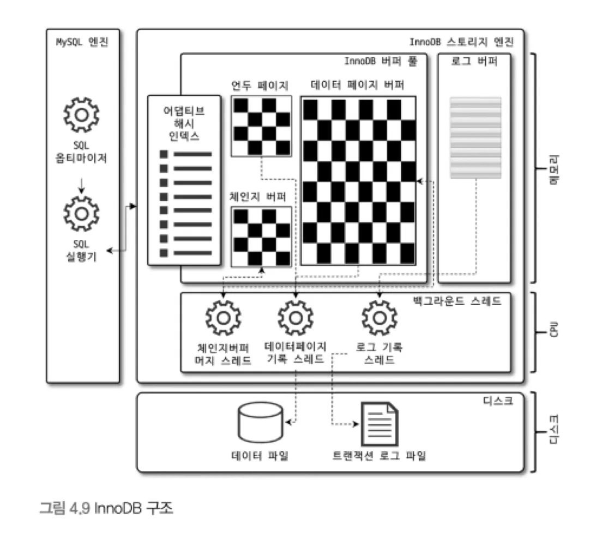
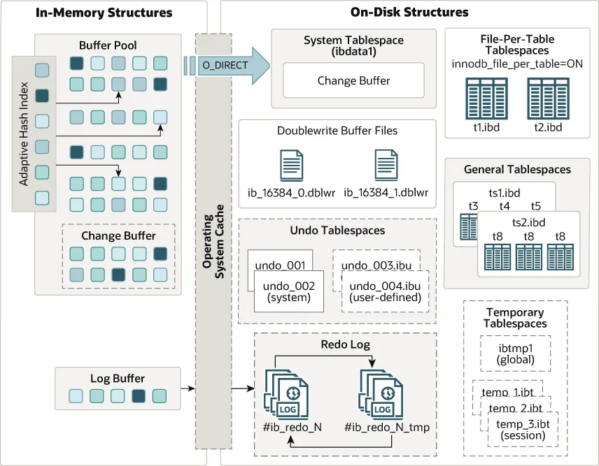
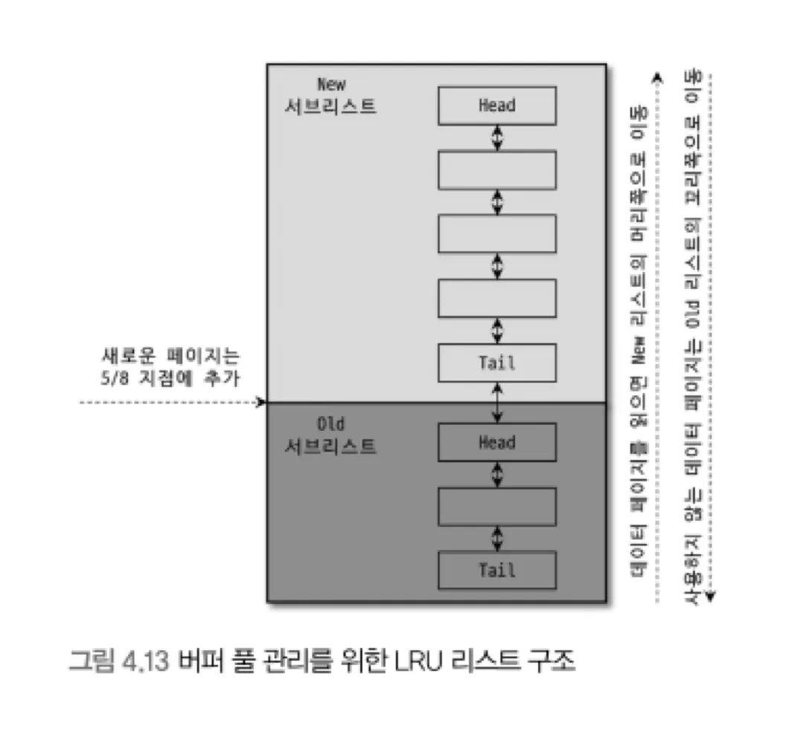
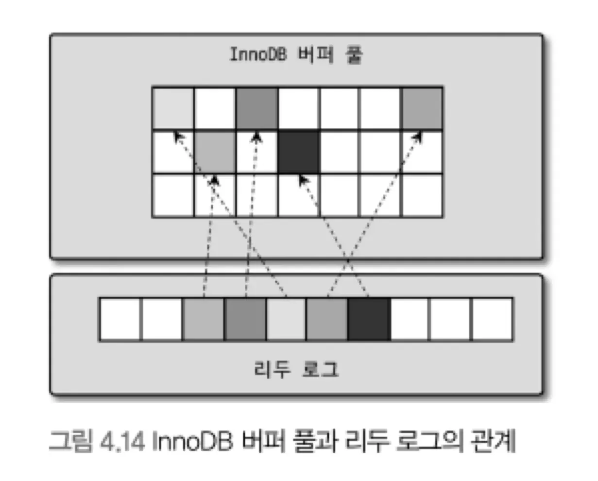
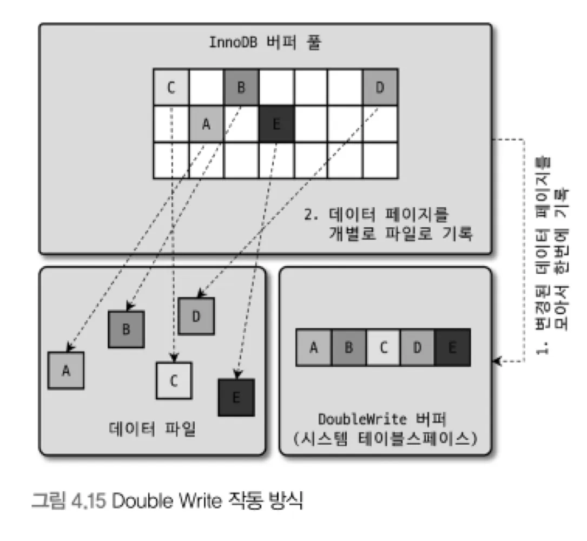
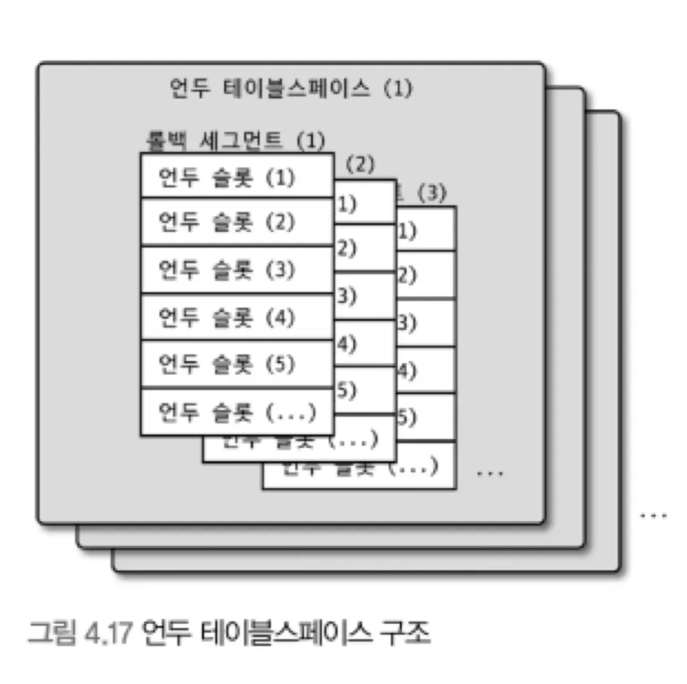
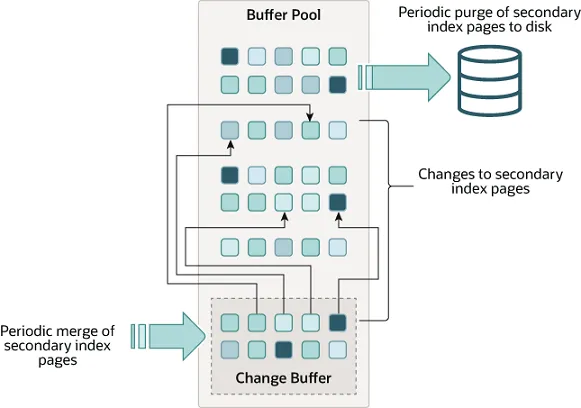

# InnoDB 스토리지 엔진 아키텍처





- 레코드 기반 잠금 제공
    - 높은 동시성 처리 가능
- MySQL InnoDB 논리적 단위

## PK에 의한 클러스터링

- PK를 기준으로 클러스터링
    - **PK 순서대로 디스크에 저장**
    - PK를 이용한 Range Scan 성능 굿
- 세컨더리 인덱스는 PK의 값을 논리 주소로 사용
    - 세컨더리 인덱스(`email`) → PK(`id`) → 데이터(`name`) 조회

    ```
    Secondary Index (idx_email)         Clustered Index (PK: id)
    ============================        ============================
    email        |  PK(id)         ➡    id   |  name   |  email
    -------------------------           -------------------------
    alice@a.com  |   101                101  |  Alice  | alice@a.com
    bob@b.com    |   102                102  |  Bob    | bob@b.com
    zoe@z.com    |   103                103  |  Zoe    | zoe@z.com
    ```

- 참고) MyISAM은 `RowID`


## FK 지원

- 부모 테이블과 자식 테이블에 **인덱스** 생성
- 변경 시, 부모 테이블이나 자식 테이블에 데이터가 있는지 체크하는 작업 필요

  → 잠금이 여러 테이블로 전파


```sql
트랜잭션 A BEGIN;
DELETE FROM parent WHERE id = 1;
 ├─ 🔒 parent → 'id=1'에 LOCK
 └─ 🔒 child → 'parent_id=1' 있는지 확인 위해 LOCK

⇒ 다른 트랜잭션은 child에 INSERT 못함
```

## MVCC

- 목적 : **잠금 없는 일관된 읽기**
    - by 언두 로그
    - 언두 로그는 디스크에 있다
- MVCC 이용
    1. UPDATE: 커밋 실행여부와 관계없이 버퍼 풀을 새로운 값으로 변경
    2. SELECT(커밋 전): 격리 수준에 따라 조회 데이터 달라짐
        - `READ_UNCOMMITTED` : 버퍼 풀 → 커밋 여부 관계없이 **변경된 데이터** 반환
        - `READ_COMMITTED` 이상 : 언두 로그 → **변경 전 데이터** 반환
    3. COMMIT
        - MVCC를 위해 언두 바로 삭제 X

          → 필요로 하는 트랜잭션이 없을 때 삭제

          → 트랜잭션 빠르게 완료할 필요

        - 리두 로그 flush → 지금 상태를 영구적인 데이터로 (Durability 보장)
    4. ROLLBACK: 언두 로그에 있는 데이터를 버퍼 풀로 복구, 언두 삭제

## 자동 데드락 감지

- 데드락에 걸리지 않았는지 체크하기 위해 잠금 대기 목록 관리
- **데드락 감지 스레드**
    - 주기적으로 잠금 대기 그래프를 검사해 데드락 걸린 트랜잭션 중 하나 강제 종료
        - 강제 종료 기준: 언두 로그 양

> [**TOO DEEP OR LONG SEARCH IN THE LOCK TABLE WAITS-FOR GRAPH, WE WILL ROLL BACK FOLLOWING TRANSACTION**](https://dev.mysql.com/doc/refman/8.4/en/innodb-deadlock-detection.html)
>
> - 잠금 대기 목록에 트랜잭션이 200개 이상 연결되어 있는 경우
> - 데드락 감지 스레드가 잠금 대기 목록에 있는 트랜잭션들이 소유한 잠금 개수가 100만 개 이상인 경우

## 자동화된 장애 복구

- `innodb_force_recovery`: 단계별 복구 모드 설정
    - 0보다 큰 경우 INSERT, UPDATE, DELETE 작업 방지
    - 4 이상으로 설정하면 읽기 전용 모드 (SELECT만 가능. DDL 불가)
    - 값이 클수록 더 작은 값의 기능도 포함 (ex. 3 **⊃** 1, 2)
1. `SRV_FORCE_IGNORE_CORRUPT`
    - **데이터나 인덱스 페이지**가 손상됐을 때
    - 데이터나 인덱스 페이지가 손상돼도 무시하고 시작
2. `SRV_FORCE_NO_BACKGROUD`
    - **언두 데이터 삭제 과정에서 장애** 발생했을 때
    - 메인 스레드를 시작하지 않고 서버 시작
    - 메인 스레드: 주기적으로 불필요한 언두 데이터 삭제 (undo purge)
3. `SRV_FORCE_NO_TRX_UNDO`
    - **커밋되지 않고 종료된 트랜잭션을 롤백하지 않음**
    - 언두 로그 읽기 가능하지만 롤백하지 않음
4. `SRV_FORCE_NO_IBUF_MERGE`
    - **체인지 버퍼 내용 무시**하고 시작
    - 인덱스 관련 부분이므로 데이터 손실 없이 복구 가능
    - 모든 세컨더리 인덱스 삭제 후 다시 생성 권장
5. `SRV_FORCE_NO_UNDO_LOG_SCAN`
    - **언두 로그 무시**하고 시작
    - 언두 로그 읽기가 불가능

      → 롤백 못 함

      → 커밋되지 않은 작업도 커밋된 것처럼 처리

6. `SRV_FORCE_NO_LOG_REDO`
    - **리두 로그 무시**하고 시작
        - COMMIT 하고 FLUSH 안 된 데이터 복구 불가
    - 마지막 체크포인트 시점의 데이터만 남음
    - 기존 리두 로그 모두 삭제 권장

| 단계 | 버퍼풀 (데이터) | **UNDO LOG** | **REDO LOG** (버퍼 → 디스크) | 디스크 |
| --- | --- | --- | --- | --- |
| UPDATE | 변경됨 (dirty) | ✅ 생성됨 (수정 전 스냅샷) | ✅ 기록됨 (버퍼에만) | ❌ 반영 안 됨 |
| COMMIT | 그대로 | 그대로 (이후 purge됨) | ✅ 커밋 마커 추가 + flush | ❌ 아직 반영 안 됨 (flush 전) |
| FLUSH | → clean됨 | X | X (변화 없음) | ✅ 변경 반영됨 |
| CRASH | ❌ 유실 (메모리) | 🟢 존재 | 🟢 존재 | ✅ 일부 반영 가능성 있음 |
| ROLLBACK | → 복원됨 | ↩ undo로 롤백 | ↩ redo로 재적용 | ✅ 정합성 회복됨 |


<details>
<summary>나너무슬퍼 너무헷갈려</summary>

- GPT

| 항목 | innodb_force_recovery=3 (`SRV_FORCE_NO_TRX_UNDO`) | innodb_force_recovery=5 (`SRV_FORCE_NO_UNDO_LOG_SCAN`) |
      | --- | --- | --- |
| Undo log 존재 여부 | ❌ **존재하지 않음 (생성 안 함)** | ✅ 존재함 (이전 트랜잭션 기록 있음) |
| Undo log 읽기 여부 | – (읽을 것도 없음) | ❌ 읽지 않음 (스캔 무시) |
| Rollback 가능 여부 | ❌ 불가능 | ❌ 불가능 |
| MVCC 가능 여부 | ❌ 완전 불가 (read view 쓸 수 없음) | ❌ 완전 불가 |
| 주요 목적 | 안정적으로 부팅해 데이터 **백업** 시도용 | undo 자체가 깨진 상황에서 **최후의 부팅 시도** |

- Gemini

| 항목 | innodb_force_recovery=3 (`SRV_FORCE_NO_TRX_UNDO`) | innodb_force_recovery=5 (`SRV_FORCE_NO_UNDO_LOG_SCAN`) |
      | --- | --- | --- |
| Undo log 존재 여부 | ✅ 존재함 (생성됨) | ✅ 존재함 |
| Undo log 읽기 여부 | ✅ 읽음 (하지만 롤백 생략) | ❌ 읽지 않음 (스캔 자체 무시) |
| 롤백 가능 여부 | ❌ 불가능 | ❌ 불가능 |
| MVCC 작동 여부 | ❌ 정상적으로 작동하지 않음 | ❌ 완전히 불가능 |
| 주요 목적 | 언두 로그는 정상이지만, 복구 시 롤백을 건너뛰어 DB 기동 (데이터 백업) | 언두 로그 자체가 손상되어 스캔 불가 시 강제 기동 (최후의 수단) |

</details>

### SRV_FORCE_NO_TRX_UNDO(3), SRV_FORCE_NO_UNDO_LOG_SCAN(5) 비교

- 둘 다 언두 로그를 사용하지 않는데 이게 왜 나뉘어졌을까?
    - SRV_FORCE_NO_TRX_UNDO을 사용하는 경우
        - 언두 로그는 있지만 트랜잭션이 꼬였다
        - 예: 크래시 직전 중간 커밋된 트랜잭션이 있음 -> 롤백 시 오류
        - 이때는 롤백만 막으면 복구 가능
        - 이 경우 SRV_FORCE_NO_TRX_UNDO로 데이터를 살릴 수 있는 가능성 존재
        - 언두 로그는 여전히 읽기 가능해서 일부 select도 가능 -> 최대한 정합성 보존하면서 복구 가능
    - SRV_FORCE_NO_UNDO_LOG_SCAN 사용하는 경우
        - 언두 로그 자체가 깨져 있거나 스캔 불가능한 상황
        - 예: 언두 로그 페이지가 물리적으로 손상됨 (디스크 깨짐)
        - 이 경우 언두 로그를 읽으려 하면 DB가 죽음
        - 결론은 애초에 언두 로그를 읽지 말자


- 둘 다 언두로그가 존재 하는가?
  - 둘 다 존재하지만 정상적으로 존재하는지의 여부 차이 인듯
      - SRV_FORCE_NO_TRX_UNDO는 정상적으로 존재, SRV_FORCE_NO_UNDO_LOG_SCAN 는 훼손
- 결론
  - DB가 장애로 죽었을때 innodb_force_recovery 옵션을 단계별로 적용하면서 db가 죽지않고 실행되면서 덤프가 떠지는지를 확인해야하는 과정에서 얼마만큼의 손실을 감당해야 되는지 단계별로 알 수 있다.

## InnoDB 버퍼 풀

1. **데이터 파일이나 인덱스 정보를 메모리에 캐시**해 두는 공간
2. 쓰기 작업을 지연시켜 일괄 작업으로 처리하는 **버퍼 역할**

### 버퍼 풀 구조

- 버퍼 풀을 chunk size로 나누고 데이터 페이지 저장

**자료구조**

1. **LRU(Least Recently Used) 리스트**
    - LRU(Old) + MRU(Most Recently Used, New) 리스트
    - 목적: 디스크로부터 한 번 읽어온 페이지를 최대한 오랫동안 버퍼 풀에 유지하여 디스크 읽기 최소화
    - 오랫동안 읽지 않은 거 LRU의 Tail 쪽으로 밀려나다가 Eviction

   

2. **플러시 리스트**
    - 더티 페이지의 변경 시점 기준의 페이지 목록 관리
    - 데이터가 변경되면 변경 내용을 리두 로그에 기록하고 버퍼 풀의 데이터 페이지에도 변경 내용 반영
    - 리두 로그 디스크 기록 시점 ≠ 데이터 페이지 디스크 기록 시점
    - 체크포인트: 디스크의 리두 로그와 데이터 페이지의 상태 동기화
        - 더티 페이지를 디스크에 기록, 리두 로그 제거 가능

          → 리두 로그의 어느 부분부터 복구를 실행해야 할지 판단하는 기준점

3. **프리 리스트**
    - 현재 사용되지 않고 즉시 재사용 가능한 페이지 목록
    - 버퍼 풀에서 실제 사용자 데이터로 채워지지 않은 페이지들의 목록
    - 사용자의 쿼리가 새롭게 디스크의 데이터 페이지를 읽어와야 하는 경우 사용

**데이터 찾는 과정**

1. 필요한 레코드가 저장된 데이터 페이지가 버퍼 풀에 있는지 검사
    1. 어댑티드 해시 인덱스 이용해 페이지 검색
    2. 인덱스 이용해 버퍼 풀에서 페이지 검색
    3. **데이터 페이지 있으면 MRU 방향**
2. 디스크에서 필요한 데이터 페이지를 버퍼 풀에 적재, 적재된 페이지에 대한 포인터를 **LRU 헤더 부분**에 추가
3. LRU 헤더 부분에 적재된 데이터 페이지가 읽히면 MRU 헤더 부분으로 이동
    - Read Ahead(미리 읽어오는) 경우에는 X
4. Age에 따라 버퍼 풀에서 제거
5. 자주 접근된 페이지의 인덱스 키를 어댑티브 해시 인덱스에 추가

### 버퍼 풀과 리두 로그



- 버퍼 풀
    - 클린 페이지: 디스크에서 읽은 상태에서 변경 없음
    - 더티 페이지: 변경된 데이터
- 리두 로그
    - 1개 이상의 고정 크기 파일을 연결해서 순환 고리처럼 사용
    - 재사용 가능한 공간과 당장 재사용 불가능한 공간 구분해서 관리 필요
        - 활성 리두 로그: 재사용 불가능한 공간
- 체크포인트
    - 리두 로그와 더티 페이지를 디스크로 동기화
    - 체크포인트 LSN(Log Sequence Number)보다 작은 리두 로그 엔트리와 관련된 더티 페이지는 모두 디스크로 동기화

```
🟡 START TRANSACTION
  |
  ▼
🔧 데이터 변경 (UPDATE, INSERT 등)
  |
  ├─► Buffer Pool에 해당 페이지 로딩 (없으면 디스크에서)
  └─► Buffer Pool에 데이터 변경 (→ Dirty Page 됨)
  |
  └─► Redo Log Buffer에 변경 기록 기록 (WAL 원칙)
  |
  ▼
✅ COMMIT
  |
  ├─► Redo Log Buffer → Redo Log File에 flush 
  |        (Durability 보장 목적)
  ▼
📌 Checkpoint 발생
  |
  ├─ Checkpoint LSN까지 Redo Log → 디스크 반영 완료 (복구 시점 최적화 + redo log 공간 회수 목적)
  └─ Dirty Page 일부/전체 → 디스크에 flush

```

### 버퍼 풀 플러시

**플러시 리스트 플러시**

- 플러시 리스트 플러시 호출 → 변경 오래된 데이터 페이지 순서대로 디스크에 동기화
    - 리두 공간 비우고 재활용하기 위해
    - 리두 공간 비우려면 더티 페이지가 디스크로 동기화돼야 함
- 어댑티브 플러시
    - 리두 로그의 증가 속도를 분석해 적절한 수준의 더티 페이지가 버퍼 풀에 유지될 수 있도록 디스크 쓰기 실행
    - 설정값에 의존하지 않고 새로운 알고리즘 사용
- 이웃 페이지 동시 쓰기
    - 근접한 더티 페이지 있다면 묶어서 기록

**LRU 리스트 플러시**

- LRU 리스트에서 **사용 빈도가 낮은 데이터 페이지들을 제거**해서 새로운 페이지들을 읽어올 공간 만들기 위해 사용
- LUR 리스트 끝부분부터 시작해 더티 페이지는 디스크에 동기화, 클린 페이지는 프리 리스트로 이동
    - 더티 페이지는 덮어쓰면 데이터가 날아가는데 (그래서 덮어쓰기 전에 flush 필요)
    - 프리 리스트에 있으면 그냥 덮어써도 됨

### 버퍼 풀 상태 백업 및 복구

- 백업: LRU 리스트에서 적재된 데이터 페이지의 메타 정보만 가져와 저장 → 빠름
- 복구: 백업된 애요에서 각 테이블 페이지를 디스크에서 읽어옴 → 느림

### 버퍼 풀의 적재 내용 확인

- `information_schema.innodb_cached_indexes` 테이블
    - 테이블의 인덱스별로 데이터 페이지가 얼마나 버퍼 풀에 적재돼 있는지 확인

### Double Write Buffer

- 문제) Partial-page, Torn-page: 페이지가 일부만 기록되는 현상
- 해결) **Double-Write** 기법
    - 더티 페이지를 묶어서 시스템 테이블스페이스의 DoubleWrite 버퍼에 한 번의 **디스크** 쓰기로 기록

      → 각 더티 페이지를 파일에 하나씩 랜덤 쓰기

    - 비정상 종료 후 재시작될 때 DoubleWriter 버퍼의 내용과 데이터 파일의 페이지들을 비교
    - 다른 내용의 페이지에 DoubleWriter 버퍼의 내용을 복사

  


## 언두 로그

- 트랜잭션 보장: 변경 전 데이터 저장
- 격리 수준 보장: 다른 컨넥션에서 데이터 조회 시 격리 수준에 맞게 변경 전 데이터 조회

### 언두 로그 레코드 모니터링

- 트랜잭션이 완료되어도 언두 로그 바로 삭제X
- 언두 로그 사용 공간
    - MySQL 5.5 : 줄일 수 없음
    - MySQL 8.0 : 돌아가면서 순차적 사용 가능, 사용 공간 자동 감소 지원

### 언두 테이블스페이스 관리

- 언두 테이블스페이스: 언두 로그가 저장되는 공간
- 서버가 초기화될 때 언두 테이블스페이스 생성되기 때문에 확장에 한계
- MySQL 8.0 이상
    - 별도 로그 파일에 기록
    - 새로운 언두 테이블스페이스를 동적으로 추가(`CREATE UNDO TABLESPACE`), 삭제(`DROP TABLESPACE`) 가능



## 체인지 버퍼



- 레코드가 INSERT되거나 UPDATE될 때는 해당 테이블에 포함된 **인덱스를 업데이트 하는 작업 필요**
- 변경해야 할 인덱스 페이지가 버퍼 풀에 있으면 바로 업데이트를 수행
- 세컨더리 인덱스의 경우 디스크로부터 읽어와서 업데이트해야 한다면 **체인지 버퍼**에 저장
    - **유니크 인덱스(ex. PK)는 체인지 버퍼 사용 불가**
    - 체인지 버퍼 머지 스레드(백그라운드 스레드): 체인지 버퍼에 캐시된 변경 사항 병합

## 리두 로그 및 로그 버퍼

- 리두 로그는 ACID 중 Durable(영속성)과 연관
- 서버가 비정상적으로 종료됐을 때 데이터 파일에 기록되지 못한 데이터를 잃지 않게 해줌
- 데이터 변경 내용을 로그로 먼저 기록(WAL, Write Ahead Log)
- 비정상 종료가 발생하면 리두 로그의 내용을 이용해 데이터 파일을 다시 서버가 종료되기 직전의 상태로 복구
- 리두 로그는 트랜잭션이 커밋되면 즉시 디스크로 기록하는 것 권장 (default)

### 어댑티드 해시 인덱스

- InnoDB 스토리지 엔진에서 사용자가 자주 요청하는 데이터에 대해 자동으로 생성하는 인덱스
- **목적: B-Tree 검색 시간을 줄이기**
    - 자주 읽히는 데이터 페이지의 키 값을 이용해 해시 인덱스를 만듦
    - 필요할 때마다 어댑티브 해시 인덱스를 검색해 레코드가 저장된 데이터 페이지를 즉시 찾음
- 테이블을 삭제하거나 변경 → 테이블이 가진 모든 데이터 페이지의 내용을 어댑티브 해시 인덱스에서 제거
- MySQL 8.0 → 경합을 줄이기 위한 파티션 기능 제공
- 해시 인덱스 = 인덱스 키 값 + 데이터 페이지 주소
    - 인덱스 키 값 = B-Tree 인덱스의 고유번호 + B-Tree 인덱스의 실제 키 값
    - 데이터 페이지 주소 = **버퍼 풀에 로딩된** 페이지 주소

      → **버퍼 풀에 올려진 데이터 페이지에 대해서만 관리**

      → **디스크에서 읽어오는 경우 도움 안 됨**


# InnoDB 설정값.zip

**FK**

- `foreign_key_checks`
    - `off`: FK 관계에 대한 체크 작업 멈춤 → 빠름
    - `ON DELEATE CASCADE`, `ON UPDATE CASCADE` 무시

    ```sql
    SET forign_key_checks=OFF;
    ==
    SET SESSION forign_key_checks=OFF;
    ```


**DeadLock**

- [`innodb_table_locks`](https://dev.mysql.com/doc/refman/8.4/en/innodb-parameters.html#sysvar_innodb_table_locks): 테이블 잠금 조회 가능 여부
    - default 값은 `on`
    - `off`: MySQL 엔진에서 관리되는 **테이블 잠금**은 볼 수 없음 (**레코드 잠금 인식**)
- [`innodb_deadlock_detect`](https://dev.mysql.com/doc/refman/8.4/en/innodb-parameters.html#sysvar_innodb_deadlock_detect) : 데드락 감지 활성화 여부
    - 데드락을 찾기 위한 새로운 잠금으로 성능 저하가 발생할 때 비활성화 고려
- [`innodb_lock_wait_timeout`](https://dev.mysql.com/doc/refman/8.4/en/innodb-parameters.html#sysvar_innodb_lock_wait_timeout): 레코드 잠금 timeout.
    - 테이블 잠금에 적용X

**BufferPool**

- [`innodb_buffer_pool_size`](https://dev.mysql.com/doc/refman/8.4/en/innodb-parameters.html#sysvar_innodb_buffer_pool_size)
    - [`innodb_buffer_pool_chunk_size`](https://dev.mysql.com/doc/refman/8.4/en/innodb-parameters.html#sysvar_innodb_buffer_pool_chunk_size)
    - [`innodb_buffer_pool_instances`](https://dev.mysql.com/doc/refman/8.4/en/innodb-parameters.html#sysvar_innodb_buffer_pool_instances)
- Flush
    - [`innodb_page_cleaners`](https://dev.mysql.com/doc/refman/8.4/en/innodb-parameters.html#sysvar_innodb_page_cleaners): (더티 페이지 동기화하는) 클리너 스레드 개수
    - [`innodb_max_dirty_pages_pct`](https://dev.mysql.com/doc/refman/8.4/en/innodb-parameters.html#sysvar_innodb_max_dirty_pages_pct): 더티 페이지 비율
    - [`innodb_max_dirty_pages_pct_lwm`](https://dev.mysql.com/doc/refman/8.4/en/innodb-parameters.html#sysvar_innodb_max_dirty_pages_pct_lwm): 사전 flush 활성화되는 더티 페이지 비율
    - [`innodb_io_capacity`](https://dev.mysql.com/doc/refman/8.4/en/innodb-parameters.html#sysvar_innodb_io_capacity)
    - [`innodb_io_capacity_max`](https://dev.mysql.com/doc/refman/8.4/en/innodb-parameters.html#sysvar_innodb_io_capacity_max)
    - [`innodb_adaptive_flushing`](https://dev.mysql.com/doc/refman/8.4/en/innodb-parameters.html#sysvar_innodb_adaptive_flushing)
    - [`innodb_flush_neighbors`](https://dev.mysql.com/doc/refman/8.4/en/innodb-parameters.html#sysvar_innodb_flush_neighbors)
- DoubleWriter
    - [`innodb_doublewrite`](https://dev.mysql.com/doc/refman/8.4/en/innodb-parameters.html#sysvar_innodb_doublewrite)

**Undo TableSpace**

- [`innodb_undo_log_truncate`](https://dev.mysql.com/doc/refman/8.4/en/innodb-parameters.html#sysvar_innodb_undo_log_truncate)
- [`innodb_purge_rseg_truncate_frequency`](https://dev.mysql.com/doc/refman/8.4/en/innodb-parameters.html#sysvar_innodb_purge_rseg_truncate_frequency)

**Change Buffer**

- [`innodb_change_buffering`](https://dev.mysql.com/doc/refman/8.4/en/innodb-parameters.html#sysvar_innodb_change_buffering)

**Redo Log**

- [`innodb_flush_log_at_trx_commit`](https://dev.mysql.com/doc/refman/8.4/en/innodb-parameters.html#sysvar_innodb_flush_log_at_trx_commit)
- [`innodb_log_file_size`](https://dev.mysql.com/doc/refman/8.4/en/innodb-parameters.html#sysvar_innodb_log_file_size)
- [`innodb_log_files_in_group`](https://dev.mysql.com/doc/refman/8.4/en/innodb-parameters.html#sysvar_innodb_log_files_in_group)
