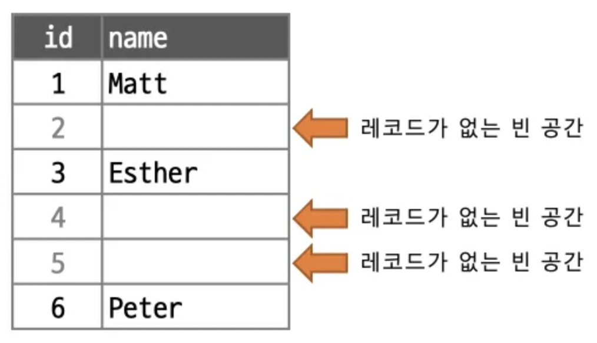

## InnoDB 스트로지 엔진 잠금
- 레코드 기반의 잠금 방식을 탑재
- INNODB_TRX, INNODB_LOCKS, INNODB_LOCK_WAITS  테이블을 조인해서 트랜잭션 잠금 확인
	- LOCKS, LOCK_WAITS 는 8.0 부터 사라졌다고 한다
- performance_schema 의 data_locks, data_lock_waits 를 이용

### InnoDB 스토리지 엔진의 잠금
- **레코드 락이 페이지 락 또는 테이블 락으로 레벨업 되는 경우가 없다**
- 대신 레코드 사이의 간격을 잠그는 갭(GAP) 락이 존재
	- 레코드가 존재하지 않는 빈 공간을 잠근다 -> 다른 트랜잭션이 삽입 불가
!
#### 레코드 락
- 레코드를 직접 잠그지 않고 인데스의 레코드를 잠근다.
#### 갭 락
- 프라이머리 키, 유니크 인덱스에 의한 변경이 아닐 때
https://medium.com/daangn/mysql-gap-lock-다시보기-7f47ea3f68bc

#### 넥스트 키 락
- 레코드 락 + 갭 락
- innodb_locks_unsafe_for_binlog(binary log) 비활성화 = 0
	- 넥스트 키 락 방식 
- innodb_locks_unsafe_for_binlog(binary log) 활성화 = 1
	- 레코드 락만 걸거나, 락을 덜 강하게 사용
	- **Statement 기반 복제에서 데이터 일관성이 깨질 위험이 있음**

- 넥스트 키 락과 갭 락으로 인해 데드락 발생 높다
	- 레플리카만의 문제가 아니라 master db 에서도 똑같이 발생
	
1. **STATEMENT 기반 (쿼리문 자체 기록)**
2. **ROW 기반 (변경된 행 정보 기록)** 8.0 기본

#### 자동 증가 락
- AUTO_INCREMENT 락
	- 테이블 락을 사용
	- INSERT, REPLACE 에서 걸린다

- innodb_autoinc_lock_mode = 0
	- 단순 테이블 락
- innodb_autoinc_lock_mode = 1
	- 일반적으로 0 이랑 동일
	- 레코드 건수를 알 수 있을 때 (bulk insert) 뮤텍스를 이용해 처리
	- 하나의 insert 에서는 순차적으로 증가 여러 insert 에서는 안될수도
		- 중간에 구멍날수도 있다
- innodb_autoinc_lock_mode = 2
	- 연속된 자동 증가 보장 X
	- 현재 기본 모드
### 인덱스와 잠금
```sql
mysql> SELECT COUNT(*) FROM employees WHERE first_name='Georgi';
+----------+
| 253 |
+----------+
mysql> SELECT COUNT(*) FROM employees WHERE first_name='Georgi' AND last_name='Klassen';
+----------+
| 1 |
+----------+
mysql> UPDATE employees SET hire_date=NOW() WHERE first_name='Georgi' AND last_name='Klassen';
```
- last_name 대한 인덱스가 없을때 총 253 건의 레코드가 잠긴다.
- 인덱스가 없으면 모든 레코드가 잠김
	- 테이블 락은 아니다
### 레코드 수준의 잠금 확인 및 해제
- performace_schema
- data_locks
	- REC_NOT_GAP (레코드 잠금시 NO GAP 의미)
- data_lock_waits
