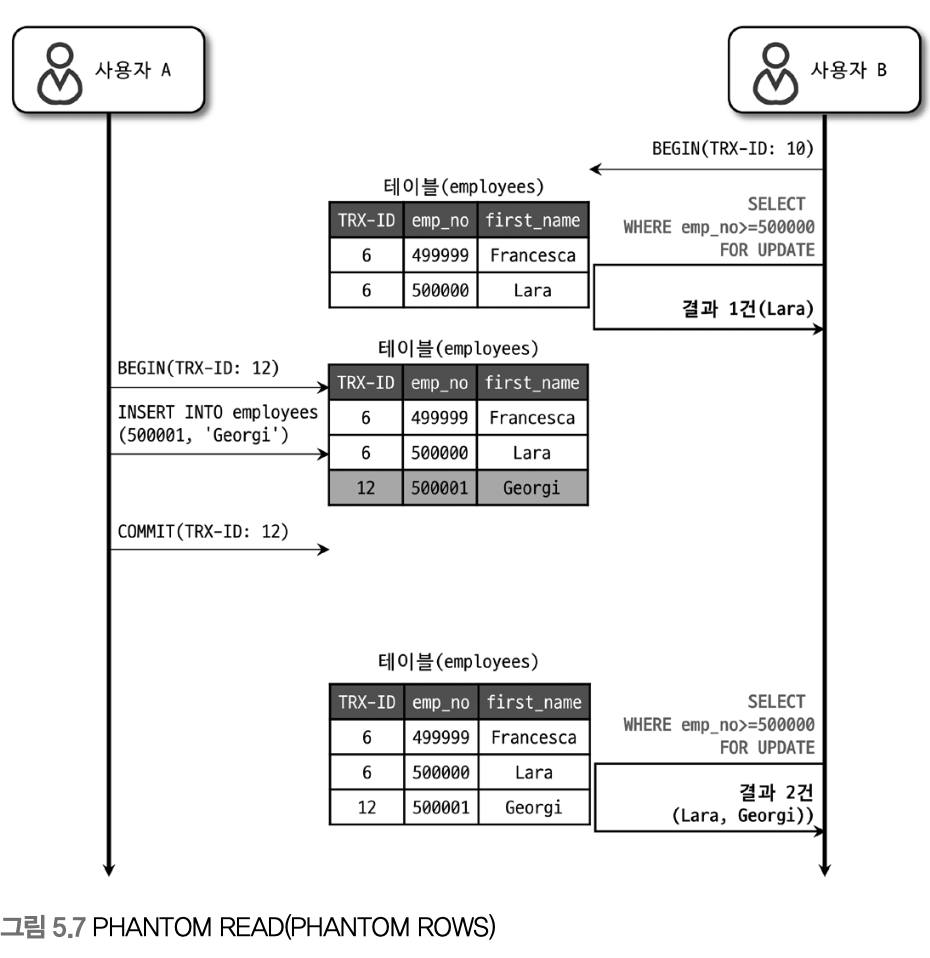

## MySQL 격리 수준
| 트랜잭션 격리 수준       | DIRTY READ | NON-REPEATABLE READ | PHANTOM READ    |
| ---------------- | ---------- | ------------------- | --------------- |
| READ UNCOMMITTED | 발생         | 발생                  | 발생              |
| READ COMMITTED   | 없음         | 발생                  | 발생              |
| REPEATABLE READ  | 없음         | 없음                  | 발생 (InnoDB는 없음) |
| SERIALIZABLE     | 없음         | 없음                  | 없음              |
- 오라클 같은 DBMS는 주로 READ COMMITED
- MySQL 은 REPEATABLE READ
### READ UNCOMMITED
!!
- 커밋 여부와 상관 없이 변경점이 다른 트랜잭션에서 보인다
	- 더티 리드
### READ COMMITTED
!!
- 더티 리드는 발생하지 않는다
- 하지만 NON REPEATABLE READ
!!
### REPEATABLE READ
- MySQL 기본 격리
!!
- 사용자 B 의 10 번 트랜잭션 안에서 실행되는 모든 SELECT 는 트랜잭션 번호 10보다 작은 트랜잭션 번호에서 변경한 것만 보게 된다

!!
- 하지만 새로운 insert 가 발생시 PHANTOM READ 발생
### SERIALIZABLE
- 읽기 작업도 공유 잠금 획득
- InnoDB 에서는 갭 락과 넥스트 키락 덕분에 PHANTOM READ 발생 안해서 사용 할 필요성이 적다
	- SELECT … FOR UPDATE, SELECT … LOCK IN SHARE 에서는 발생 할 수도

| **쿼리**                      | **팬텀 리드 방어 정도** | **주의 사항**                                 |
| --------------------------- | --------------- | ----------------------------------------- |
| SELECT (기본 MVCC)            | 팬텀 없음           |                                           |
| SELECT … FOR UPDATE         | 거의 없음           | 인덱스 타는 경우는 안전, 인덱스 없으면 발생 가능              |
| SELECT … LOCK IN SHARE MODE | 발생 가능성 있음       | optimizer가 gap lock 건너뛰는 경우 있음 (실제 사례 있음) |
