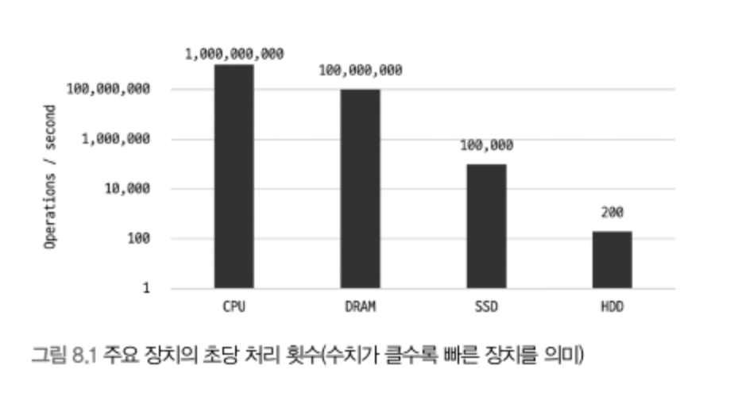
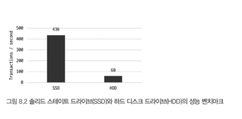
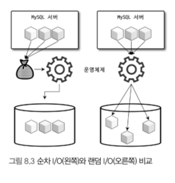

### 8.1 디스크 읽기 방식

---

1. 종류
    - 하드 디스크(HDD)
        - 저장용 플래터(원판)를 기계적으로 회전시키며 데이터 I/O 수행 → 성능이 느림
    - 솔리드 스테이트 드라이브(SSD)
        - 플래시 메모리 기반으로 데이터를 빠르게 I/O 가능 → 성능이 빠름
        - 

2. 동작 방식
    - 방식
        - 하드 디스크 드라이브의 원판을 회전시켜 작업할 데이터로 헤더를 이동한 후 I/O 수행
    - 랜덤 I/O vs 순차 I/O

      

| 항목 | 순차 I/O | 랜덤 I/O |
| --- | --- | --- |
| 정의 | 연속된 페이지(예: 3×16KB)를 한 번에 디스크에 기록 | 각각의 페이지를 디스크에 개별적으로 기록 |
| 디스크 헤드 이동 | 1번 이동 | 3번 이동 |
| 시스템 콜 요청 | 1회 | 3회 |
| 속도 | 빠름 | 순차 I/O보다 최대 3배 느림 |
| 작업 부하 | 작음 | 많음 (작은 단위의 읽기/쓰기 작업이 많음) |
| 데이터베이스에서의 활용 | 대용량 쓰기에서 효율적 | 작은 데이터를 자주 읽고 쓰는 경우 많음 (예: MySQL의 바이너리 로그, InnoDB 로그 버퍼 등) |
| SSD에서의 성능 차이 | 적게 나타남 | 여전히 Throughput은 떨어짐 |
| 주의 사항 | SSD라도 순차/랜덤 I/O 차이를 인식하고 구분하여 사용해야 함 |  |
- 순차/랜덤 I/O 비교는 단순화된 예시로, 실제 환경에서는 동기 I/O 실행 여부, 캐시, RAID 컨트롤러 등 다양한 요소의 영향이 존재
- 기업용 DB 서버에서는 캐시 메모리와 RAID 컨트롤러로 랜덤 I/O 성능을 개선 가능

### 참고 자료
  - [RAID 컨트롤러란?](https://ilovestorage.tistory.com/16)
