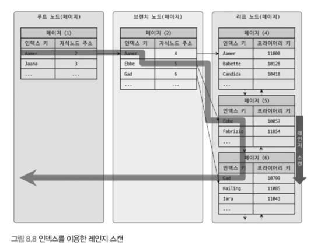

### 8.3 B-Tree 인덱스

---

1. 구조 및 특성
    - 루트 노드: 브랜치 노드로 가는 주소를 저장
    - 브랜치 노드: 리프 노드로 가는 주소를 저장
    - 리프 노드: 실제 데이터를 찾기 위한 주소를 저장
        - MyISAM: 실제 물리적인 데이터를 가리킴
        - InnoDB: (세컨더리 인덱스의 경우) PK 인덱스 주소를 가리킴
      


2. 인덱스 키 추가
    - 인덱스 키 값에 따라 B-Tree 상의 적절한 위치를 찾아 리프 노드에 저장
    - 일반적으로 테이블에 레코드를 추가하는 비용을 1이라 하면 인덱스는 1.5배 정도
    - InnoDB는 PK나 유니크 인덱스가 아니면 체인지 버퍼에 모아두었다가 배치 처리
3. 인덱스 키 삭제
    - 삭제할 인덱스가 저장된 리프 노드를 마킹 후 나중에 재활용
4. 인덱스 키 변경
    - 기존 키를 삭제하고 새로 추가하는 방식(체인지 버퍼 사용)
    - UPDATE나 DELETE 쿼리 시 넥스트 키 락에 의해 인덱스에 락이 걸림(성능 유의)
        - 인덱스 설계를 잘해야 함
5. 인덱스 키 값의 크기
    - 페이지: InnoDB가 디스크에 데이터를 저장하는 가장 기본 단위(디스크의 모든 읽기 쓰기 작업의 단위)
    - innodb_page_size: 4KB~64KB(기본값: 16KB)
    - 인덱스 크기가 커지면 디스크로부터 데이터를 읽어야 하는 횟수가 증가
    - 선택도(기수성) = Selectivity(Cardinality): 모든 인덱스 키 값 중 유니크한 값의 수
        - 기수성이 높을수록 효율이 좋음
6. 인덱스 읽기

   - 인덱스를 읽어야 하는 양이 전체 레코드의 20%~25%를 초과하면 옵티마이저는 자동으로 풀 테이블 스캔

    - 이 경우 힌트를 추가해서 강제로 인덱스를 사용하게 함(force index)

`인덱스 레인지 스캔`

  

   - 인덱스 조건에서 만족하는 값이 저장된 위치 탐색 <인덱스 탐색 Index Seek>
   - 탐색된 위치에서 필요한 만큼 인덱스를 차례대로 읽음 <인덱스 스캔 Index Scan>
   - 실제 데이터가 필요하면 파일에서 데이터를 읽어옴(커버링 인덱스 유무)

`인덱스 풀 스캔`

    

     - 인덱스를 처음부터 끝까지 읽음
   - 인덱스로 조회 시 인덱스를 구성하는 칼럼 중 앞쪽 칼럼을 누락하면 발생
   - 커버링 인덱스의 경우에만 적용

`루스 인덱스 스캔`

    

  - 순차적으로 인덱스를 스캔하면서 필요 없는 인덱스는 무시(SKIP)하고 스캔
  - GROUP BY 또는 집합 함수 중 MAX(), MIN() 함수에 대해 최적화하는 경우에 사용

`인덱스 스킵 스캔`

   
    
   - (A,B, ..) 같은 인덱스 구조에서 A를 빼고 B의 조건으로 조회할 때 뒤에 배치된 인덱스만으로도 인덱스를 사용할 수 있게 함
   - MySQL 8.0부터 지원
   - 옵티마이저가 내부적으로 앞에 위치한 칼럼값을 구해서 조건에 넣고 실행하는 것과 같은 최적화를 수행
   - 신규 도입된 기능이라 단점 존재
       - 인덱스의 선행 칼럼의 유니크한 값의 개수가 적어야 함
       - 커버링 인덱스인 경우에만 가능

`다중 칼럼 인덱스`

    

   - 2개 이상의 칼럼으로 구성된 인덱스
   - 후행 칼럼의 정렬은 선행 칼럼의 영향을 받음
       - 선행 칼럼 내에서만 후행 칼럼의 정렬이 유효

`인덱스의 정렬 및 스캔 방향`

   - 8.0부터는 각 칼럼마다 다르게 정렬 순서를 설정할 수 있음
   - **CREATE INDEX ix_teamname_userscore ON employees (team_name ASC, user_score DESC)**
   - 인덱스를 사용할 때 생성 시점과 별개로 사용 시점에 오름차순 또는 내림차순 조회할지 결정
     - 그럼 내림차순 인덱스가 필요 없을까?
       - 페이지 잠금이 인덱스 정순 스캔에 적합한 구조
       - 페이지 내에서 인덱스 레코드가 단방향으로만 연결된 구조 (다 읽은 다음에 다시 소팅하거나 역순으로 다시 읽어야됨)

       

`B-Tree 인덱스의 가용성과 효율성`

```sql
비교 조건의 효율성

mysql > SELECT * FROM dept_emp
WHERE dept_no='d002' AND emp_no >= 10114 ;

• 케이스 A: INDEX (dept_no, emp_no)
	-> dept_no로 먼저 정렬이 되어있어서 더 적은 양의 레코드를 탐색해도 됨
• 케이스 B: INDEX (emp_no, dept_no)
	-> emp_no가 먼저이므로 범위에 맞는 emp_no를 먼저 고른다음 dept_no가 해당하는지 확인해야 하므로
	더 많은 레코드를 탐색해야 될 수 있음
```

`인덱스를 사용할 수 없는 경우`

- NOT-EQUAL로 비교된 경우(<>, NOT IN, NOT BETWEEN, IS NOT NULL)

    ```sql
    .. WHERE col <> 'N'
    .. WHERE col NOT IN (10,11,12)
    .. WHERE col IS NOT NULL
    ```

- LIKE ‘%??’ 와 같이 뒷부분 일치 형태로 문자열 패턴이 비교된 경우

    ```sql
    .. WHERE col LIKE '%승환'
    .. WHERE col LIKE '_승환'
    .. WHERE col LIKE '%승%'
    ```

- 스토어드 함수나 다른 연산자로 인덱스 칼럼이 변형된 후 비교된 경우

    ```sql
    .. WHERE SUBSTRING(col, 1, 1) = 'x'
    .. WHERE DAYOFMONTH(col) = 1
    ```

- NOT-DETERMINSTIC 속성의 스토어드 함수가 비교 조건에 사용된 경우

    ```sql
    .. WHERE col = deterministic_function
    ```

- 데이터 타입이 서로 다른 비교(인덱스 칼럼의 타입을 변환해야 비교가 가능한 경우)

    ```sql
    .. WHERE char_column = 10
    ```

- 문자열 데이터 타입의 콜레이션이 다른 경우

    ```sql
    .. WHERE utf8_bin_char_column = euckr_bin_char_column
    ```
`다중 컬럼 인덱스 사용 조건`

```sql
INDEX ix_test (col1, col2, col3, ... coln)
```

- 작업 범위 결정 조건으로 인덱스를 사용하지 못하는 경우
    - col1 칼럼에 대한 조건이 없는 경우
    - col1 칼럼의 비교조건이 사용할 수 없는 조건 중 하나인 경우
- 사용 가능한 경우
    - col1 ~ col(i-1) 까지 `=` 비교 형태 또는 `in` 비교
    - coli에 대해 다음 연산자 중 하나로 비교
        - `=` 비교 또는 `in`
        - 크다 작다 형태
        - LIKE로 좌측 일치 패턴 (`LIKE ‘승환%’`)
