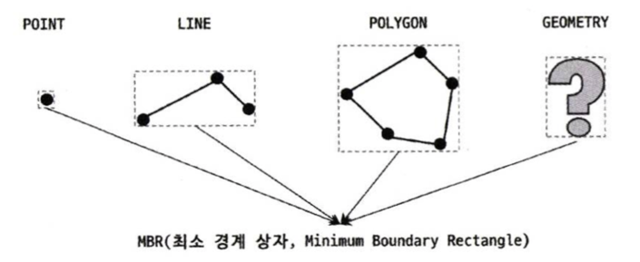
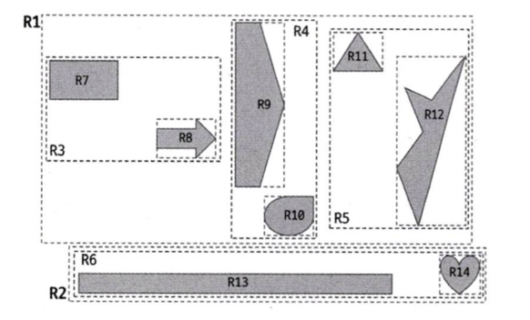

## 8.4 R-Tree 인덱스
R-Tree 인덱스는 **공간 데이터를 효율적으로 저장하고 검색**하기 위해 고안된 자료 구조이다.

일반적인 B-Tree가 1차원 데이터를 위한 인덱스라면, R-Tree는 2차원 이상의 공간 데이터를 다룬다.
- 이 인덱스는 다차원 공간에서 데이터를 효율적으로 관리할 수 있도록 도와준다
- GPS나 지도 서비스에서 위치 정보를 저장하고 검색하는 데 사용된다

<br>

### 8.4.1 구조 및 특성
MySQL은 공간 정보의 저장 및 검색을 위해 여러 기하학적 도형 정보를 관리할 수 있는 데이터 타입을 제공한다.
- **MBR**라는 개념을 사용하여 공간 데이터를 관리한다
- Geometry: Point, Line, Polygon 객체 모두를 저장할 수 있는 데이터 타입

<br>

#### 구조


이러한 도형이 저장됐을 때 MBR을 3개의 레벨로 나누어 그릴 수 있다.
- **최상위 MBR**: R-Tree의 루트 노드에 해당하며, 전체 도형을 포함하는 최소 경계 사각형
  - ex) R1, R2 
- **차상위 MBR**: 최상위 MBR을 포함하는 MBR로, 하위 도형들을 그룹화
  - ex) R3, R4, R5, R6 
- **하위 MBR**: 개별 도형을 포함하는 MBR로, 실제 도형의 위치와 크기를 나타냄
  - ex) R7 ~ R14 

<br>

#### R-Tree 인덱스 내부


R-Tree 인덱스는 **MBR을 사용하여 공간 데이터를 계층적으로 구성**한다.
- 최상위 MBR은 R-Tree의 루트 노드에 저장되는 정보이며, 차상위 MBR은 브랜치 노드, 하위 MBR은 리프 노드에 저장된다

<br>

### 8.4.2 R-Tree 인덱스의 용도
R-Tree는 일반적으로 GPS 기준의 위도, 경도 좌표 저장에 사용되며 CAD/CAM 등 좌표 시스템에 기반을 둔 정보에 대해 모두 적용할 수 있다.


그림에서 가운데의 'P'가 기준점이다. 기준점으로부터 반경 거리 5km 이내의 점들을 검색하려면 우선 사각 점선의 상자에 포함되는 점들을 검색한다.
`ST_Contains()`, `ST_Within()` 연산은 다각형으로만 연산 가능하여 반경 5km 원을 포함하는 최소 사각형(MBR)으로 포함 관계 비교를 수행한다.

```sql
-- // ST_Contains() or ST_Within() 연산을 이용해 "사각 상자"에 포함된 좌표 Px만 검색

SELECT * FROM tb_location WHERE ST_Contains(사각 상자, px);

SELECT * FROM tb_location WHERE ST_Within(px, 사각 상자);
```
- 두 함수는 거의 동일한 비교를 수행하지만 두 함수의 파라미터의 순서는 반대이다.


<br>

### ✅ 요약
- R-Tree는 공간 데이터를 위한 인덱스로, MBR을 기반으로 계층적으로 구성된다
- `ST_Contains`, `ST_Within`과 같은 함수와 함께 공간 조건 검색에 활용된다
- 특히 GIS, 위치 기반 서비스(LBS), CAD/CAM 등의 분야에서 유용하다
