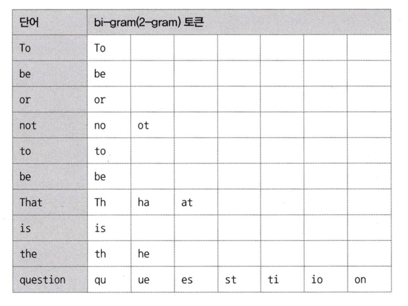

## 8.5 전문 검색 인덱스
앞서 살펴본 인덱스들은 주로 숫자나 짧은 문자열처럼 **정형화된 값**에 대해 빠르게 조회할 수 있도록 설계된 구조였다. 하지만 **문서 전체의 내용을 기반으로 특정 키워드를 검색**하는 전문 검색(Full-Text Search)의 경우, 별도의 인덱싱 알고리즘이 필요하다.

**문서의 내용 전체를 인덱스화해서 특정 키워드가 포함된 문서를 검색**하는 전문(Full Text) 검색에는 InnoDB나 MyISAM 엔진에서 제공하는 일반적인 B-Tree 인덱스를 사용할 수 없다.
- MySQL 8.0부터는 InnoDB 엔진 중심으로 개선되고 있어 InnoDB 엔진 중심으로 소개한다

<br>

### 8.5.1 인덱스 알고리즘
전문 검색에서는 문서 내용에서 검색하게 될 키워드를 분석해 빠르게 검색할 수 있도록 인덱스를 구성한다.
- 전문 검색 인덱스는 크게 단어의 **어근 분석**과 **n-gram 분석** 알고리즘으로 나눌 수 있다

<br>

### 8.5.1.1 어근 분석 알고리즘
MySQL 서버의 전문 검색 인덱스는 두 가지 과정을 거쳐 색인 작업이 수행된다.

**1. 불용어(Stop Word) 처리**

검색에서 별 가치가 없는 단어를 모두 필터링해서 제거하는 작업이다.
- 불용어(Stop Word): 검색에 큰 의미가 없는 단어(예: "the", "is", "a")로, 색인 대상에서 제외된다
    - MySQL은 기본 불용어 목록을 제공하지만, 사용자가 직접 추가하거나 제거할 수 있다


<br>

**2. 어근 분석(Stemming)**

**선정된 단어의 뿌리인 원형을 찾는 작업**이다. MySQL 서버에서는 오픈소스 형태소 분석 라이브러리인 MeCab를 지원한다.

한글이나 일본어의 경우 영어와 같이 단어의 변형 자체는 거의 없어 어근 분석보다 문장의 형태소를 분석해서 명사와 조사를 구분하는 기능이 더 중요하다.
각 국가의 언어가 서로 문법이 다르고 다른 방식으로 발전해왔기 때문에 형태소 분석이나 어근 분석 또한 언어별로 방식이 모두 다르다.
- MeCab: 일본어를 위한 형태소 분석기, 한글 분석도 가능
- Snowball: 영어를 위한 형태소 분석기

<br>

### 8.5.1.2 n-gram 알고리즘
MeCab을 위한 형태소 분석은 매우 전문적인 전문 검색 알고리즘이어서 만족할 만한 결과를 내기 위해서는 많은 노력과 필요로 한다.

이런 단점을 보완하기 위해 n-gram 알고리즘이 도입됐다. 형태소 분석이 문장을 이해하는 알고리즘이라면, n-gram은 단순히 키워드를 검색해내기 위한 인덱싱 알고리즘이라고 할 수 있다.

n-gram이란 본문을 무조건 몇 글자씩 잘라서 인덱싱하는 방법이다. 형태소 분석보다는 알고리즘이 단순하고 국가별 언어에 대한 이해와 준비 작업이 필요없지만, 인덱스의 크기는 상당히 큰 편이다.

<br>

MySQL 서버에서 2-gram 알고리즘으로 다음 문장의 토큰을 분리해보자.


MySQL 서버는 이렇게 생성된 토큰에 대해 불용어를 걸러내는 작업을 수행한다. 그리고 구분된 토큰들을 B-Tree 인덱스에 저장한다.
- MySQL 서버에 내장된 불용어는 `information_schema.INNODB_FT_DEFAULT_STOPWORD` 테이블에 저장되어 있다

```sql
-- // To be or not to be. That is the question

SELECT * FROM information_schema.INNODB_FT_DEFAULT_STOPWORD;

+-----------------+
| value           |
+-----------------+
| a               |
| about           |
| an              |

...
+-----------------+
```

<br>

### 8.5.2 전문 검색 인덱스 가용성
전문 검색 인덱스를 사용하려면 반드시 다음 두 가지 조건을 갖춰야 한다.
- 쿼리 문장이 전문 검색을 위한 문법(MATCJ ... AGAINST ...)을 사용
- 테이블이 전문 검색 대상 칼럼에 대해서 전문 인덱스 보유

다음과 같이 전문 검색 인덱스를 생성하자.
```sql
CREATE TABLE tb_test (
    doc_id INT PRIMARY KEY AUTO_INCREMENT,
    doc_body TEXT,
    PRIMARY KEY (doc_id),
    FULLTEXT KEY fx_docbody (doc_body) WITH PARSER ngram
) ENGINE=InnoDB;
```

전문 검색 인덱스를 사용해 검색하려면 `MATCH ... AGAINST` 문법을 사용해야 한다.
```sql
SELECT * FROM tb_test
WHERE MATCH(doc_body) AGAINST('애플' IN BOOLEAN MODE);
```

<br>

### ✅ 요약
- 전문 검색 인덱스는 정형화되지 않은 텍스트 데이터를 검색하는 데 사용된다.
- MySQL에서는 어근 분석(Stemming)과 n-gram 알고리즘 기반 인덱싱을 제공한다.
- `MATCH ... AGAINST` 구문을 통해 전문 검색이 가능하며, FULLTEXT 인덱스를 필수로 생성해야 한다.
