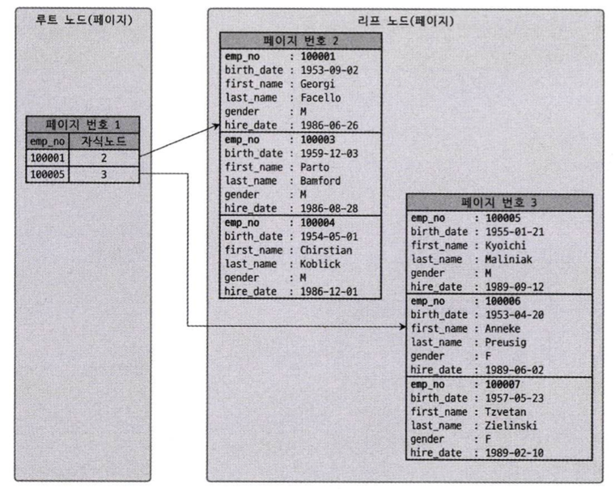

# 8.8 클러스터링 인덱스
MySQL 서버에서 클러스터링은 **테이블의 레코드를 PK 기준으로 묶어 저장**한다. 이는 주로 비슷한 값들을 동시에 조회하는 경우가 많다는 점에서 착안한 것이다.
- MySQL에서 InnoDB 스토리지 엔진에서만 지원한다

<br>

### 8.8.1 클러스터링 인덱스
클러스터링 인덱스는 PK에 대해서만 적용되며, **PK 값에 의해 레코드의 저장 위치가 결정**된다.

즉, PK 값이 변경된다면 그 레코드의 물리 저장 위치가 바뀌어야 한다. PK로 클러스터링된 테이블은 PK 값 자체에 대한 의존도가 상당히 크기 때문에 신중히 PK를 결정해야 한다.

<br>

#### 클러스터링 테이블 구조

클러스터링 테이블의 구조 자체는 B-Tree와 비슷하지만 리프노드에 레코드의 모든 칼럼이 같이 저장되어 있다. 즉, 클러스터링 테이블은 그 자체가 하나의 거대한 인덱스 구조로 관리된다.



클러스터링 테이블에서 다음 쿼리를 실행한다면 어떤 변화가 일어날까?
```sql
UPDATE tb_test SET emp_no=100002 WHERE emp_no=100007;
```

이전 그림에서는 100007 레코드가 3번 페이지에 저장되어 있지만 emp_no가 변경되면서 2번 페이지로 이동하게 된다.


<br>

그럼 PK가 없는 InnoDB 테이블은 어떻게 클러스터링 테이블로 구성될까? PK가 없다면 다음 우선순위대로 PK를 대체할 칼럼을 선택한다.
1. PK가 있으면 그 칼럼을 클러스터링 키로 사용
2. `NOT NULL` 옵션의 유니크 인덱스 중 첫 번째 인덱스를 클러스터링 키로 사용
3. 자동으로 유니크한 값을 가지도록 증가되는 칼럼을 내부적으로 추가한 후, 그 칼럼을 클러스터링 키로 사용

InnoDB 스토리지 엔진이 적절한 클러스터링 키 후보를 찾지 못하면 내부적으로 아무 의미 없는 숫자 값으로 클러스터링한다. 이것은 우리에게 아무런 혜택을 주지 않으므로 가능하다면 PK를 명시적으로 생성하자.


<br>

### 8.8.2 세컨더리 인덱스에 미치는 영향
PK나 세컨더리 인덱스의 각 키는 `ROWID`를 이용해 실제 데이터 레코드를 찾아온다. 그래서 MyISAM이나 MEMORY 테이블에서는 PK와 세컨더리 인덱스는 구조적으로 아무런 차이가 없다.

InnoDB에서는 클러스터링 키(PK)가 레코드의 실제 주소 역할을 한다.

만약 세컨더리 인덱스가 레코드 주소를 직접 저장한다면, PK가 바뀔 때마다 모든 인덱스의 주소를 갱신해야 하는 문제가 발생한다. 이를 방지하기 위해 InnoDB의 세컨더리 인덱스는 주소 대신 해당 레코드의 PK 값을 저장한다.


<br>

### 8.8.3 클러스터링 인덱스의 장점과 단점
**장점**
- PK로 처리할 대 처리 성능 매우 빠름 (특히, PK를 범위 검색하는 경우)
- 모든 세컨더리 인덱스가 PK를 가지고 있어 인덱스만으로 처리될 수 있는 경우가 많음 (== 커버링 인덱스)

**단점**
- 모든 세컨더리 인덱스가 클러스터링 키를 가지므로 클러스터링 키 값이 커지면 전체적으로 인덱스의 크기가 커짐
- 세컨더리 인덱스를 통해 검색할 때 PK로 다시 한번 검색해야 함
- `INSERT`할 때 PK에 의해 레코드의 저장 위치가 결정되어 처리 성능이 느림
- PK를 변경할 때 레코드를 `DELETE`하고 `INSERT`하는 방식으로 처리되므로 처리 성능이 느림

<br>

단점이 있지만, 일반적인 웹 서비스와 같은 온라인 트랜잭션 환경에서는 쓰기와 읽기의 비율이 2:8 또는 1:9 정도이기 때문에 조금 느린 쓰기를 감수하고 읽기를 빠르게 유지하는 것이 중요하다.

<br>

### 8.8.4 클러스터링 테이블 사용 시 주의사항
### 8.8.4.1 클러스터링 인덱스 키의 크기
클러스터링 테이블의 경우 모든 세컨더리 인덱스가 PK 값을 포함하므로 **PK 크기가 커지면 세컨더리 인덱스도 자동으로 크기가 커진다.** 
- 프라이머리 키가 10바이트에서 50바이트로 커지면 레코드 건수가 100만 건이면 190MB, 1000만 건이면 1.9GB 증가한다
또한 인덱스가 커질수록 같은 성능을 내기 위해 그만큼의 메모리가 필요해지므로 InnoDB 테이블의 PK는 신중히 선택해야 한다.

<br>

### 8.8.4.2 프라이머리 키는 AUTO-INCREMENT보다는 업무적인 칼럼으로 생성(가능한 경우)
InnoDB에서 PK로 검색하는 경우 클러스터링되지 않은 테이블에 비해 매우 빠르게 처리된다. 그만큼 PK는 중요한 역할을 수행하며 검색에서 상당히 빈번하게 사용된다.

그러므로 그 칼럼의 크기가 크더라도 업무적으로 해당 레코드를 대표할 수 있다면 그 칼럼을 PK로 설정하는 것이 좋다.

<br>

### 8.8.4.3 프라이머리 키는 반드시 명시할 것
가능하면 `AUTO_INCREMENT`를 사용해 PK를 생성하는 것을 권장한다. InnoDB 테이블에서 PK를 정의하지 않으면 InnoDB 스토리지 엔진이 내부적으로 사용자가 접근할 수 없는 일련번호 칼럼을 추가한다.

또한 ROW 기반의 복제나 InnoDB Cluster에서는 모든 테이블이 PK를 가져야만 하는 정상적인 복제 성능을 보장하기도 하므로 PK는 꼭 생성하자.

<br>

### 8.8.4.4 AUTO-INCREMENT 칼럼을 인조 식별자로 사용할 경우
세컨더리 인덱스도 필요하고 PK의 크기도 길다면 `AUTO_INCREMENT` 칼럼을 추가하고, 이를 PK로 설정하면 된다. 이렇게 **PK를 대체하기 위해 인위적으로 추가된 PK**를 **인조 식별자**라고 한다.

로그 테이블과 같이 조회보다는 `INSERT` 위주의 테이블은 `AUTO_INCREMENT`를 이용한 인조 식별자를 PK로 설정하는 것이 성능 향상에 도움이 된다.