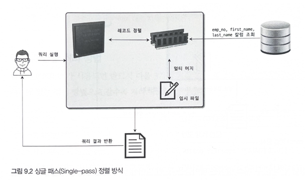
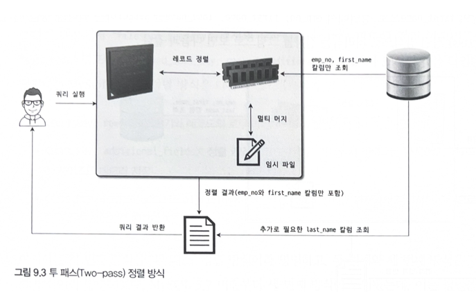
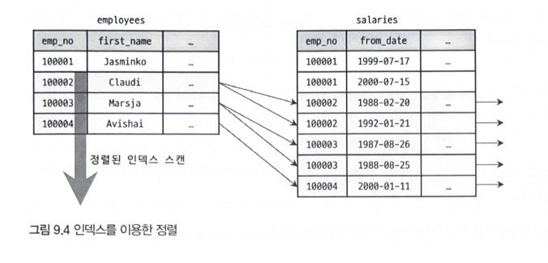
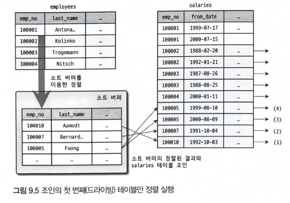
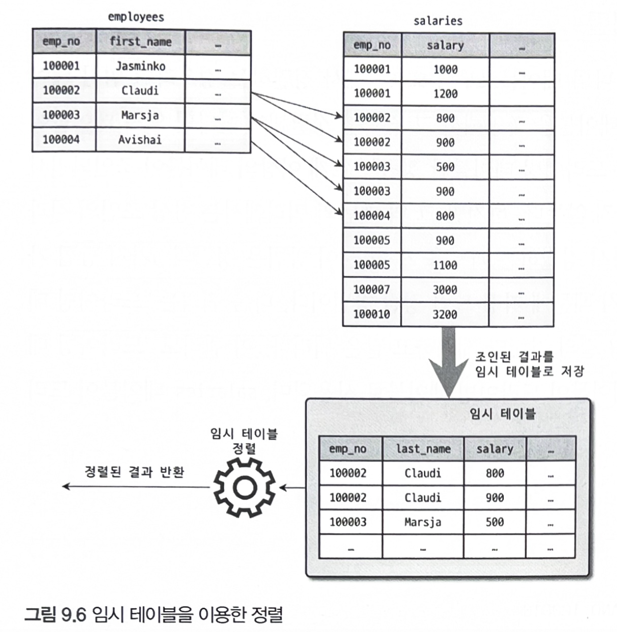
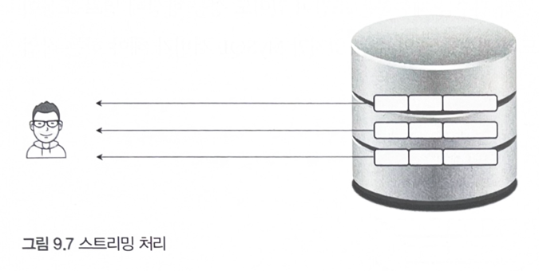
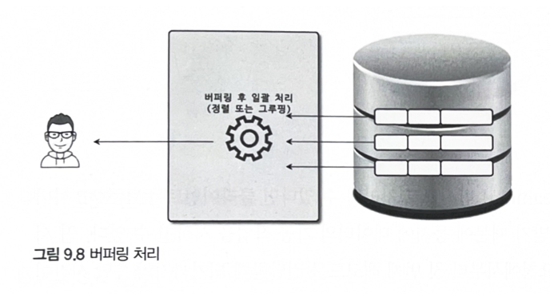

## 9.2 기본 데이터 처리

모든 RDBMS는 데이터를 정렬하거나 그룹핑하는 등의 기본적인 가공 처리를 제공한다.
이번에는 MySQL에서 주로 사용하는 데이터 접근 방식인 **풀 테이블 스캔**과 **풀 인덱스 스캔**에 대해 살펴보자.

---

### 9.2.1 풀 테이블 스캔과 풀 인덱스 스캔

MySQL 옵티마이저는 다음과 같은 조건에서 **풀 테이블 스캔**을 선택한다.

- 레코드 수가 적어 인덱스를 사용하는 것보다 테이블 전체를 읽는 편이 더 효율적일 때
- `WHERE`나 `ON` 절에 인덱스를 활용할 수 있는 조건이 없을 때
- 인덱스 레인지 스캔이 가능하더라도, 조건 일치 레코드 수가 너무 많아 인덱스 사용이 비효율적일 때

> 일반적으로 **테이블 전체는 인덱스보다 훨씬 크기 때문에**, 풀 테이블 스캔은 많은 디스크 읽기를 발생시킨다.
> 대부분의 DBMS는 이런 경우 **여러 페이지를 한 번에 읽는 기능**을 제공한다.

<br>

#### InnoDB와 리드 어헤드(Read-ahead)

MySQL의 **InnoDB 스토리지 엔진**은 풀 테이블 스캔 시, 처음 몇 개의 데이터 페이지는 포그라운드 스레드가 읽고, 이후에는 **백그라운드 스레드가 리드 어헤드를 수행**한다.
리드 어헤드는 앞으로 필요할 것으로 예상되는 페이지를 미리 디스크에서 읽어 **버퍼 풀에 적재**해 두는 기능이다.
이 덕분에 포그라운드 스레드는 준비된 데이터를 바로 읽을 수 있어 쿼리 성능이 향상된다.

> 참고: MyISAM에서는 페이지를 하나씩 읽는 구조이며, 리드 어헤드가 적용되지 않는다.

<br>

#### 풀 인덱스 스캔

리드 어헤드는 **풀 인덱스 스캔**에도 동일하게 적용된다.

예를 들어 아래 쿼리는 `employees` 테이블의 전체 레코드 수만 필요하므로 **인덱스를 사용하는 것이 더 효율적**이다.

```sql
SELECT COUNT(*)
FROM employees;
```

이 경우, 옵티마이저는 **테이블 전체를 읽는 것보다 용량이 작은 인덱스를 스캔**하는 것을 선택할 수 있다.

하지만 다음과 같이 **레코드에만 존재하는 컬럼**이 필요한 경우엔 인덱스만으로는 처리가 불가능하므로 **풀 테이블 스캔**이 사용된다.

```sql
SELECT *
FROM employees;
```

<br>

---

### 9.2.2 병렬 처리

MySQL 8.0부터 제한적이지만 **단일 쿼리에 대한 병렬 처리**가 가능해졌다.

> 여기서 **병렬 처리**란, **하나의 쿼리를 여러 스레드가 나누어 동시에 처리하는 것**을 의미한다.
> 여러 스레드가 **각각의 쿼리를 독립적으로 처리**하는 것은 MySQL 초기 버전부터 가능했다.

MySQL 8.0에서는 `innodb_parallel_read_threads` 시스템 변수를 통해 **병렬 읽기 스레드 수**를 설정할 수 있다.

* 병렬 스레드 수를 늘리면 쿼리 처리 속도가 빨라질 수 있지만,
  **서버의 CPU 코어 수를 초과하면 오히려 성능 저하**가 발생할 수 있으므로 주의가 필요하다.

<br>

---

### 9.2.3 ORDER BY (Using Filesort)

MySQL에서 `ORDER BY`로 정렬을 수행할 때는 크게 두 가지 방식이 있다.

1. **인덱스를 이용한 정렬**
2. **Filesort(파일 정렬 알고리즘)를 이용한 정렬**

| 구분     | 인덱스 이용                                                                                                        | Filesort 이용                                              |
|--------|---------------------------------------------------------------------------------------------------------------|----------------------------------------------------------|
| **설명** | 정렬 기준 컬럼에 인덱스가 존재할 경우, 해당 인덱스를 활용하여 정렬 수행                                                                     | 정렬 기준 컬럼에 인덱스가 없을 경우, 실행 시점에 메모리 또는 디스크에서 별도로 정렬 수행      |
| **장점** | - 인덱스에 이미 정렬된 순서대로 저장되어 있어 빠르게 정렬 가능<br>- 디스크 I/O 최소화                                                         | - 인덱스가 없어도 정렬 가능<br>- 정렬 대상 레코드 수가 적으면 메모리 내에서 빠르게 처리 가능 |
| **단점** | - DML 작업(`INSERT`/`UPDATE`/`DELETE`) 시 인덱스 유지 비용 발생<br>- 인덱스 저장 공간 추가 필요<br>- 인덱스가 많을수록 InnoDB 버퍼 풀 메모리 사용 증가 | - 레코드 수가 많을 경우 정렬 비용 증가<br>- 디스크 정렬 발생 시 성능 저하           |

<br>

> 항상 Filesort를 사용하는 것은 아니다.
> 실제 쿼리가 **인덱스를 사용하지 않고 별도의 정렬 작업을 수행**했는지는 실행 계획의 `Extra` 컬럼에서 `"Using filesort"`가 표시되는지 여부로 확인할 수 있다.

<br>

---

### 9.2.3.1 소트 버퍼 (Sort Buffer)

MySQL은 정렬을 수행할 때, 별도의 메모리 공간인 **소트 버퍼**를 할당받아 사용한다.
이 버퍼는 쿼리 실행 중에만 유지되며, **쿼리 실행이 끝나면 시스템에 반납**된다.

만약 정렬 대상 레코드 수가 소트 버퍼 크기를 초과하면, MySQL은 정렬해야 할 데이터를 **여러 조각으로 나누어 처리**한다.
이때 각 조각은 정렬된 상태로 **디스크에 임시 저장**되고, 이후 이를 다시 **병합 정렬** 방식으로 합쳐 최종 정렬 결과를 만든다.

<br>
이 과정은 다음과 같다

1. 소트 버퍼에 데이터를 채워 정렬한다.
2. 정렬된 결과를 디스크에 임시 저장한다.
3. 다음 레코드를 읽어와 정렬한 후 또다시 디스크에 저장한다.
4. 마지막에는 디스크에 저장된 여러 정렬된 조각을 **병합(Merge)** 한다.

> 이처럼 **디스크 I/O가 반복적으로 발생**하기 때문에, 소트 버퍼 크기를 무작정 크게 설정한다고 해서 반드시 성능이 향상되는 것은 아니다.

<br>

---

### 9.2.3.2 정렬 알고리즘

MySQL에서 정렬은 주로 다음 두 가지 방식 중 하나로 수행된다.

- **싱글 패스 정렬(Single-pass sort)**
- **투 패스 정렬(Two-pass sort)**

각 방식은 소트 버퍼 사용 방식과 테이블 접근 방식에서 차이를 보인다.

<br>

---

#### 1️⃣ 싱글 패스 정렬 방식

**설명**
정렬 대상 컬럼뿐만 아니라, `SELECT` 절에 포함된 **모든 컬럼을 소트 버퍼에 함께 담아 정렬**하는 방식이다.

```sql
SELECT emp_no, first_name, last_name
FROM employees
ORDER BY first_name;
```

<br>



이 쿼리에서는 `first_name` 기준으로 정렬을 수행하되, `emp_no`, `last_name`까지 **모두 소트 버퍼에 적재**한다.
정렬이 완료되면 **정렬된 데이터를 그대로 클라이언트에 전달**할 수 있어 **한 번의 테이블 접근**으로 정렬과 조회가 동시에 처리된다.

> - 장점: 테이블을 한 번만 읽기 때문에 I/O가 적다 <br>
> - 단점: 정렬 대상 컬럼이 많거나 레코드 크기가 크면 **소트 버퍼 공간이 부족해 디스크 I/O 발생 가능**

<br>

---

#### 2️⃣ 투 패스 정렬 방식

**설명**
정렬 대상 컬럼(예: `first_name`)과 **PK**만 소트 버퍼에 담아 정렬한 후, 정렬된 PK 순서에 따라 테이블을 다시 읽어 **나머지 SELECT 컬럼**을 가져오는 방식이다.

```sql
SELECT emp_no, first_name, last_name
FROM employees
ORDER BY first_name;
```

<br>



이 쿼리에서는 첫 번째 단계에서 `first_name`과 `emp_no`만 소트 버퍼에 담아 정렬한 뒤,
정렬된 `emp_no` 순서대로 테이블을 다시 읽어 `last_name`을 포함한 전체 컬럼을 조회한다.

> - 장점: 소트 버퍼에 담는 데이터가 작아 정렬 처리 시 메모리 사용량이 적음 <br>
> - 단점: 테이블을 **두 번 읽어야** 하므로 I/O 비용 증가

<br>

---

### 비교 요약

| 항목            | 싱글 패스 정렬                           | 투 패스 정렬                            |
|---------------|------------------------------------|------------------------------------|
| **동작 방식**     | SELECT 대상 전체 컬럼을 한 번에 소트 버퍼에 담아 정렬 | 정렬 대상 컬럼 + PK만 정렬 후, PK로 다시 테이블 조회 |
| **테이블 접근 횟수** | 1회                                 | 2회                                 |
| **소트 버퍼 사용량** | 큼                                  | 작음                                 |
| **I/O 효율**    | 레코드 크기 작을수록 효율적                    | 레코드 크기 크고 건수 많을수록 효율적              |
| **사용 시점**     | 최신 MySQL에서 기본적으로 사용                | 데이터 크기가 매우 큰 경우 사용 가능성 있음          |

---

> 💡 **결론**:
> MySQL 최신 버전에서는 **기본적으로 싱글 패스 정렬 방식**을 사용하며,
> 상황에 따라 옵티마이저가 내부적으로 **투 패스 정렬로 전환**할 수 있다.

<br>

---

### 9.2.3.3 정렬 처리 방법

`ORDER BY`가 포함된 쿼리는 다음 **세 가지 정렬 처리 방식** 중 하나를 통해 수행된다.
아래로 내려갈수록 처리 비용이 크고, 성능이 떨어진다.

| 정렬 처리 방식                   | 실행 계획(Extra 컬럼) 표시                |
|----------------------------|-----------------------------------|
| **인덱스를 사용한 정렬**            | 별도 표기 없음                          |
| **조인의 드라이빙 테이블만 정렬**       | `Using filesort`                  |
| **조인 결과를 임시 테이블에 저장 후 정렬** | `Using temporary; Using filesort` |

---

옵티마이저는 성능상 가장 효율적인 **인덱스를 사용한 정렬**을 우선적으로 고려한다.
만약 인덱스를 사용할 수 없거나 정렬 효율이 떨어지는 경우, 옵티마이저는 `WHERE` 조건에 일치하는 레코드를 먼저 수집한 후 정렬 처리 방법을 선택하게 된다.

이때 옵티마이저는 다음 **두 가지 전략 중 하나**를 선택할 수 있다:

- **조인의 드라이빙 테이블만 정렬한 후, 조인을 수행**
- **조인을 모두 수행한 후, 최종 결과를 정렬**

<br>

---

#### 1️⃣ 인덱스를 사용한 정렬

반드시 `ORDER BY` 절에 명시된 칼럼이 제일 먼저 읽는 테이블(조인이 사용된 경우 드라이빙 테이블)에 속하고, `ORDER BY`의 순서대로 생성된 인덱스가 있어야 한다.

또한 `WHERE` 절에 첫 번째로 읽는 테이블의 칼럼에 대한 조건이 잇다면 그 조건과 `ORDER BY`는 같은 인덱스를 사용할 수 있어야 한다.

이 경우 별도의 정렬 연산 없이 **정렬된 결과를 바로 반환**할 수 있으므로 **가장 빠르다.**

<br>



> 인덱스를 사용한 정렬이 가능한 이유는 B-Tree 인덱스가 키 값으로 정렬돼 있기 때문이다. <br>
> 또한 조인이 네스티드-루프 방식으로 실행되기에 조인 때문에 드라이빙 테이블의 인덱스 읽기 순서가 흐트러지지 않는다.

<br>

---

#### 2️⃣ 조인의 드라이빙 테이블만 정렬

일반적으로 조인이 수행되면 결과 레코드의 건수가 몇 배로 불어나고 레코드 하나하나의 크기도 늘어난다.
이 방법으로 정렬이 처리되려면 조인에서 첫 번째로 읽히는 테이블(드라이빙 테이블)의 칼럼만으로 `ORDER BY` 절을 작성해야 한다. 옵티마이저는 드라이빙 테이블만 검색해서 정렬을 먼저 수행하고 그 결과와 `salaries` 테이블을 조인한다.

<br>



1. 인덱스를 이용해 `emp_no BETWEEEN 100001 AND 100010` 조건을 만족하는 9건을 검색
2. 검색결과를 `last_name` 칼럼으로 정렬을 수행(Filesort)
3. 정렬된 결과를 순서대로 읽으면서 `salaries` 테이블과 조인을 수행해 86건의 최종 결과를 가져옴

<br>

---

#### 3️⃣ 임시 테이블을 이용한 정렬
쿼리가 여러 테이블을 조인하지 않고 하나의 테이블로부터 SELECT해서 정렬하는 경우라면 임시 테이블이 필요하지 않다. 하지만 2개 이상의 테이블을 조인해서 그 결과를 정렬해야 한다면 임시 테이블이 필요할 수도 있다.

그 외 패턴의 쿼리에서는 항상 조인의 결과를 임시 테이블에 저장하고 그 결과를 다시 정렬하는 과정을 거친다.

<br>


<br>

---

#### 4️⃣ 정렬 처리 방식별 성능 비교
주로 웹 서비스용으로 `LIMIT`과 `ORDER BY`가 필수로 사용된다. 일반적으로 `LIMIT`은 테이블이나 처리 결과의 일부만 가져오기 때문에 MySQL 서버가 처리해야 할 작업량을 줄인다. 그렇지만 `WHERE` 조건은 아무리 인덱스를 잘 활용하도록 튜닝해도 잘못된 `ORDER BY`나 `GROUP BY`로 느려지는 경우가 발생한다.

쿼리에서 인덱스를 사용하지 못하는 정렬이나 그루핑 작업이 처리되는 방법을 2가지 방식으로 구분할 수 있다.

**1. 스트리밍 방식**



- 조건에 일치하는 레코드가 검색될때마다 바로바로 클라이언트로 전송해주는 방식
  - 클라이언트는 쿼리를 요청하고 곧바로 원했던 첫 번째 레코드를 전달받는다 
- 처리 속도 빠름 (실시간 응답 가능)
- LIMIT 처럼 결과 건수를 제한하는 조건들은 쿼리의 전체 실행 시간을 상당히 줄여줄 수 있음


**2. 버퍼링 방식**



- ORDER BY나 GROUP BY 같은 처리는 쿼리의 결과가 스트리밍되는 것을 불가능하게 한다. 우선 WHERE 조건에 일치하는 모든 레코드를 가져온 후 정렬하거나 그루핑해서 차례대로 보내야 하기 때문이다.
- 복잡한 정렬 기준도 처리 가능
- 전체 결과 수집 → 정렬 후 응답까지 시간 지연


<br>

---


### 9.2.4 GROUP BY 처리

`GROUP BY` 절이 포함된 쿼리에서는 **`HAVING` 절**을 사용할 수 있으며, 이는 **`GROUP BY` 결과에 대한 필터링** 역할을 수행한다.

> 📌 주의: `GROUP BY` 절에 사용된 조건은 **인덱스를 이용할 수 없기 때문에**, `HAVING` 절 튜닝을 위해 인덱스를 생성할 필요는 없다.

---

MySQL의 `GROUP BY` 처리 방식은 **인덱스를 활용할 수 있는지 여부**에 따라 크게 세 가지로 나뉜다.

#### 1️⃣ 인덱스 스캔을 이용한 GROUP BY (Tight Index Scan)

- 조인의 **드라이빙 테이블**에 속한 컬럼만으로 `GROUP BY`를 수행할 경우, 해당 컬럼에 **인덱스가 존재한다면**, 그 인덱스를 차례로 읽으며 그룹핑이 가능하다.
- 인덱스를 통한 정렬된 순차 읽기이기 때문에, **추가적인 정렬 작업이나 임시 테이블 생성이 필요 없다.**
- 단, **그룹 함수(SUM, COUNT 등)**가 함께 사용된다면 내부적으로 임시 테이블이 사용될 수 있다.
- 실행 계획(Extra 칼럼): 특별한 코멘트 없음 (정렬이나 임시 테이블도 표시되지 않음)

<br>

---

#### 2️⃣ 루스 인덱스 스캔을 이용한 GROUP BY (Loose Index Scan)

- 인덱스에서 **필요한 부분만 건너뛰며** 읽는 방식
- `GROUP BY` 컬럼 앞에 **다른 조건 컬럼**이 있을 때 자주 사용됨
- 실행 계획(Extra): `"Using index for group-by"`


```sql
SELECT emp_no 
FROM salaries 
WHERE from_date = '1985-03-01' 
GROUP BY emp_no;
```

**MySQL의 동작 과정**:

1. `(emp_no, from_date)` 인덱스를 스캔하여 첫 번째 `emp_no = 10001`을 찾음
2. 해당 `emp_no`에 대해 `from_date = '1985-03-01'` 조건을 만족하는 레코드만 조회
3. 다음 유니크한 `emp_no`로 이동
4. 반복 수행하여 모든 그룹 처리

> 인덱스를 일부만 활용해 불필요한 레코드를 건너뛰므로 효율적
> 사용 조건이 한정적 (WHERE + GROUP BY 구조에서 특정 순서로 인덱스 구성 필요)

<br>

---

#### 3️⃣ 임시 테이블을 사용하는 GROUP BY

- `GROUP BY` 대상 컬럼에 **인덱스가 없거나**, **인덱스를 사용할 수 없는 복잡한 조인 구조**인 경우 임시 테이블을 생성하여 정렬/그룹핑을 수행 
- 실행 계획(Extra): `"Using temporary; Using filesort"`

> 디스크 기반 정렬과 임시 테이블 작업이 발생 → **가장 느리고 비효율적인 방식**

<br>

---

### 9.2.5 DISTINCT 처리

특정 컬럼의 유니크한 값만 조회하려면 `SELECT` 쿼리에 `DISTINCT`를 사용한다.
`DISTINCT`는 `MIN()`, `MAX()`, `COUNT()`와 같은 집합 함수가 **없는 경우**와 **있는 경우**로 나누어 처리 방식을 이해할 수 있다.

집합 함수와 함께 `DISTINCT`가 사용될 때 실행 계획에서 인덱스를 활용하지 못하면 **항상 임시 테이블이 필요**하지만, `Extra` 칼럼에는 `"Using temporary"` 메시지가 출력되지 않는다.

---

#### 1️⃣ `SELECT DISTINCT ...`

단순히 레코드 중 중복 없이 유니크한 값만 조회하고자 할 때 사용된다. 이 경우 처리 방식은 `GROUP BY`와 유사하다.

특히 **MySQL 8.0** 이상에서는 `GROUP BY` 절이 있고 `ORDER BY` 절이 없으면 **정렬 작업 없이** 그룹핑이 수행되기 때문에 다음 두 쿼리는 **내부적으로 동일하게 처리**된다.

```sql
SELECT DISTINCT emp_no FROM salaries;
SELECT emp_no FROM salaries GROUP BY emp_no;
```

> `DISTINCT`는 `SELECT` 절 전체에 적용되며, 여러 컬럼 중 **일부 컬럼만 유니크하게 조회하는 기능은 없다.**

예를 들어 다음 쿼리는 `first_name`만 유니크하게 만드는 것이 아니라,
`(first_name, last_name)`의 **조합이 유일한 행만** 반환한다:

```sql
SELECT DISTINCT first_name, last_name FROM employees;
```

<br>

---

#### 2️⃣ 집합 함수와 함께 사용된 `DISTINCT`

`COUNT()`, `MIN()`, `MAX()` 같은 **집합 함수 내에서 `DISTINCT`**가 사용될 수 있다.
이 경우 `SELECT DISTINCT ...`와는 의미가 다르며, 집합 함수의 인자로 전달된 컬럼의 **유니크한 값들만을 기준으로** 계산이 수행된다.

```sql
SELECT COUNT(DISTINCT emp_no) FROM employees;
```

위 쿼리는 `emp_no`의 중복을 제거한 후 건수를 세는 방식으로 동작한다.

이 경우에도 인덱스를 사용하지 못하면 **임시 테이블이 생성**되어 처리되지만, 실행 계획 상에서는 `"Using temporary"`가 표시되지 않는다.

<br>

---

### 9.2.6 내부 임시 테이블 활용

MySQL 엔진은 정렬(`ORDER BY`)이나 그룹핑(`GROUP BY`)과 같은 내부 연산을 수행할 때 **임시 테이블**을 사용한다.
여기서 말하는 임시 테이블은 `CREATE TEMPORARY TABLE` 명령으로 생성하는 **사용자 정의 임시 테이블**과는 다르며, **MySQL이 내부적으로 자동 생성**하고 쿼리 처리 이후 제거된다.

이러한 임시 테이블은 처음에는 메모리 상에 생성되며, **크기가 커지면 디스크로 옮겨진다.**
다른 세션이나 쿼리에서는 접근이 불가능하다.

---

#### 1️⃣ 메모리 임시 테이블 vs 디스크 임시 테이블

- **MySQL 8.0부터**
  - 메모리 기반 임시 테이블: `TempTable` 스토리지 엔진 사용
  - 디스크 기반 임시 테이블: `InnoDB` 스토리지 엔진 사용

<br>

---

#### 2️⃣ 임시 테이블이 필요한 경우

내부 임시 테이블이 생성되는 대표적인 경우는 다음과 같다.

**유니크 인덱스를 가지는 임시 테이블 생성 조건**

- `ORDER BY`와 `GROUP BY`에 명시된 컬럼이 서로 다른 경우
- `ORDER BY`나 `GROUP BY` 대상 컬럼이 조인의 첫 번째 테이블 컬럼이 아닌 경우
- `DISTINCT`와 `ORDER BY`가 함께 존재하는 경우
- `DISTINCT`가 인덱스로 처리되지 않는 경우
- `UNION` 또는 `UNION DISTINCT`가 사용된 경우 (→ `select_type`이 `UNION RESULT`)

**유니크 인덱스가 없는 임시 테이블 생성 조건**

- `select_type`이 `DERIVED`인 서브쿼리

> 일반적으로 **유니크 인덱스가 포함된 내부 임시 테이블은 그렇지 않은 경우보다 성능이 더 느리다.**

<br>

---

#### 3️⃣ 디스크 기반 임시 테이블이 생성되는 조건

기본적으로 임시 테이블은 메모리에 생성되지만, 아래 조건 중 하나라도 만족하면 디스크로 전환된다:

- `UNION` 또는 `UNION ALL`의 결과 중 **512바이트 이상**인 컬럼이 존재하는 경우
- `GROUP BY` 또는 `DISTINCT` 대상 컬럼이 **512바이트 이상**인 경우
- 메모리 임시 테이블 크기가 다음 중 **하나라도 초과**할 경우
  - `tmp_table_size`
  - `max_heap_table_size`
  - `temptable_max_ram`
