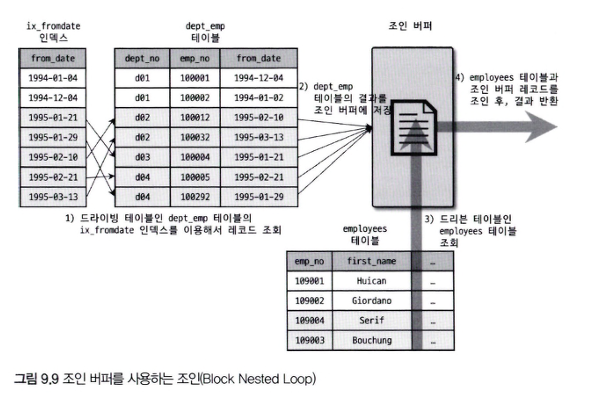
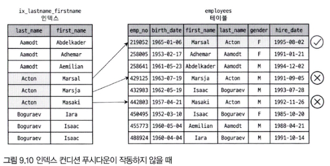
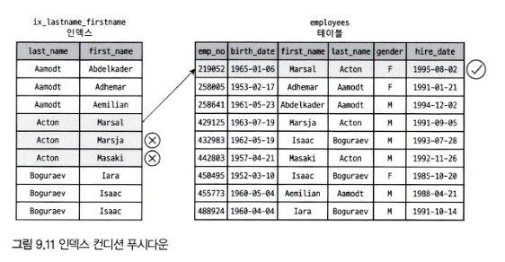
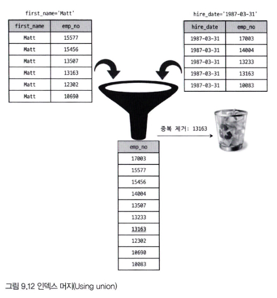
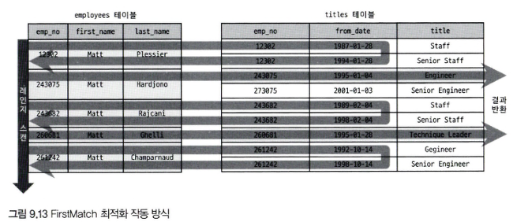
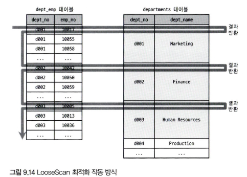
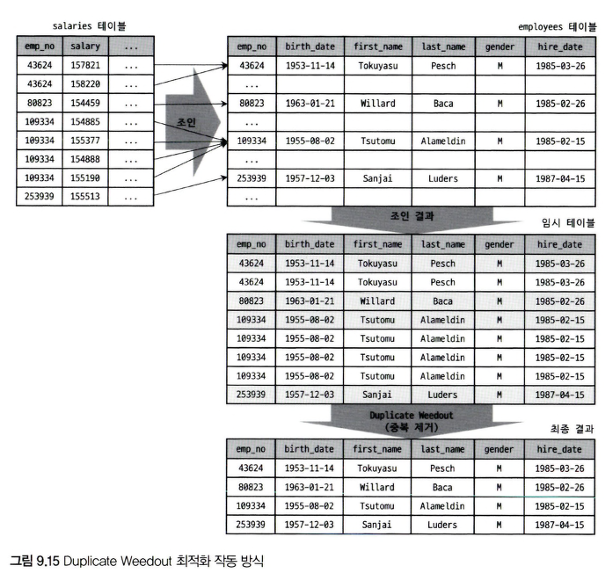
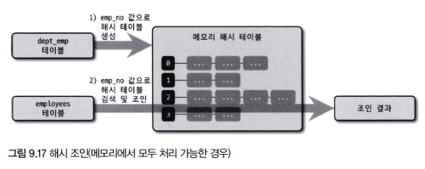
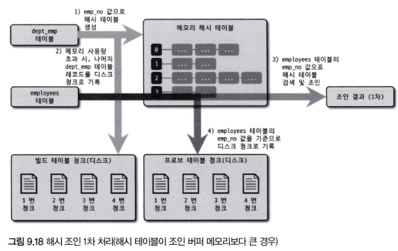
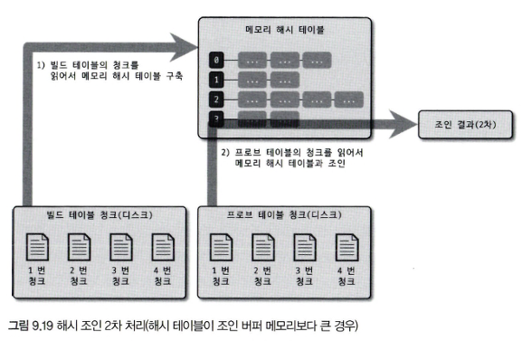

# ✅ 9.3 고급 최적화 요약

## 🔹 개요

- MySQL 옵티마이저는 통계 정보와 옵티마이저 옵션을 결합하여 최적의 실행 계획을 수립함
- 옵티마이저 옵션은 크게 두 가지로 구분됨:
    1. **조인 관련 옵티마이저 옵션**
        - MySQL 초기 버전부터 제공됨
        - 대부분 신경 쓰지 않지만, **조인이 많은 서비스에서는 중요**
    2. **옵티마이저 스위치 (`optimizer_switch`)**
        - MySQL 5.5부터 도입
        - 고급 최적화 기능의 **활성화 여부를 제어**

---

## 🔹 옵티마이저 스위치란?

- `optimizer_switch` 시스템 변수를 통해 제어
- 여러 옵션을 콤마(,)로 묶어 한 번에 설정 가능
- 각 스위치 값은 다음 중 하나로 설정:
    - `on`: 옵션 활성화
    - `off`: 옵션 비활성화
    - `default`: 기본값 적용
- 설정 범위:
    - **글로벌(Global)**: 서버 전체에 적용
    - **세션(Session)**: 현재 커넥션에만 적용

```sql
-- 예시: 글로벌 설정
SET GLOBAL optimizer_switch = 'index_merge=on,index_merge_union=on,...';

-- 예시: 세션 설정
SET SESSION optimizer_switch = 'index_merge=on,index_merge_union=on,...';

-- 예시: 쿼리별 적용 (옵티마이저 힌트 사용)
SELECT /*+ SET_VAR(optimizer_switch='condition_fanout_filter=off') */
FROM ...;
```

---

## 🔹 옵티마이저 스위치 목록

| 스위치 이름                                | 기본값 | 설명                                    |
|---------------------------------------|-----|---------------------------------------|
| `batched_key_access`                  | off | BKA 조인 알고리즘 사용 여부                     |
| `block_nested_loop`                   | on  | Block Nested Loop 조인 알고리즘 사용 여부       |
| `engine_condition_pushdown`           | on  | Engine Condition Pushdown 기능 사용 여부    |
| `index_condition_pushdown`            | on  | Index Condition Pushdown 기능 사용 여부     |
| `use_index_extensions`                | on  | Index Extension 최적화를 사용할지 여부          |
| `index_merge`                         | on  | Index Merge 최적화를 사용할지 여부              |
| `index_merge_intersection`            | on  | Index Merge Intersection 최적화를 사용할지 여부 |
| `index_merge_sort_union`              | on  | Index Merge Sort Union 최적화를 사용할지 여부   |
| `index_merge_union`                   | on  | Index Merge Union 최적화를 사용할지 여부        |
| `mrr`                                 | on  | MRR (Multi-Range Read) 최적화를 사용할지 여부   |
| `mrr_cost_based`                      | on  | 비용 기반 MRR 최적화를 사용할지 여부                |
| `semijoin`                            | on  | 세미 조인 최적화를 사용할지 여부                    |
| `firstmatch`                          | on  | FirstMatch 세미 조인 최적화를 사용할지 여부         |
| `loosescan`                           | on  | LooseScan 세미 조인 최적화를 사용할지 여부          |
| `materialization`                     | on  | Materialization 최적화를 사용할지 여부          |
| `subquery_materialization_cost_based` | on  | 비용 기반 Materialization 최적화를 사용할지 여부    |

---

## 🔹 9.3.1.1 MRR과 Batched Key Access

- **MRR (Multi-Range Read)**: 디스크 I/O 효율화를 위한 방식.  
  → 매뉴얼에서는 "DS-MRR(Disk Sweep Multi-Range Read)"라고도 불림.

- 기존 조인 방식: 드라이빙 테이블의 레코드를 1건씩 읽고 → 드리븐 테이블에서 일치 레코드를 즉시 검색  
  → 이는 **Nested Loop Join** 방식으로, 드리븐 테이블에서 매번 스토리지 엔진에 요청하므로 비효율적임.

- MySQL 구조상:
    - **조인 연산**은 MySQL 엔진에서 수행
    - **실제 레코드 검색/읽기**는 스토리지 엔진이 담당
    - → 드라이빙 테이블에서 한 건씩 읽어 넘기면, 스토리지 엔진이 최적화를 할 수 없음

- **MRR 도입 방식**
    1. 드라이빙 테이블에서 여러 레코드를 읽어 **조인 버퍼**에 저장
    2. 버퍼가 가득 차면 한 번에 드리븐 테이블로 요청
    3. 스토리지 엔진은 요청된 키들을 정렬된 순서대로 접근 가능
        - 디스크 페이지 접근 최소화
        - InnoDB 버퍼 풀 접근도 효율화

- 이 방식이 **MRR**, 이를 응용한 조인 방식이 **BKA(Batched Key Access)**

- `batched_key_access` 스위치 기본값은 `off`
    - 이유: BKA 조인은 **정렬 비용** 등 부가 작업이 있어, 쿼리에 따라 오히려 성능이 나빠질 수도 있음
    - 하지만 상황에 따라 **성능 이점을 줄 수도 있음**

## 🔹 9.3.1.2 블록 네스티드 루프 조인

- MySQL에서 기본적으로 사용하는 조인 방식은 **Nested Loop Join**
    - 조인 조건 칼럼에 모두 인덱스가 있는 경우 사용
    - 예: employees 테이블과 salaries 테이블을 `emp_no`로 조인

- **Nested Loop Join 작동 방식**
    - 드라이빙 테이블의 레코드를 1건씩 읽고
    - 조건이 일치하는 드리븐 테이블의 레코드를 즉시 검색 후 반환
    - 프로그래밍적으로 보면 중첩 for문처럼 작동함

```pseudo
for (row1 in employees) {
  for (row2 in salaries) {
    if (condition_matched) return (row1, row2);
  }
}
```

- **Block Nested Loop Join과의 차이점**
    - Block 방식은 **조인 버퍼**를 사용함
    - 조인 버퍼는 `join_buffer_size` 시스템 변수로 크기 조절 가능
    - 실행 계획의 `Extra` 컬럼에 `"Using join buffer"`가 표시되면 해당 알고리즘 사용 중

- **작동 방식 요약**
    1. 드라이빙 테이블의 결과를 조인 버퍼에 저장
    2. 드리븐 테이블에서 조건에 맞는 레코드를 조회
    3. 드리븐 테이블의 결과와 버퍼에 있는 드라이빙 테이블의 레코드를 조합하여 반환

- **예시 쿼리**

```sql
SELECT *
FROM dept_emp de,
     employees e
WHERE de.from_date > '1995-01-01'
  AND e.emp_no < 109004;
```

- 위 쿼리는 조인 조건이 없으므로 **카테시안 조인** 수행
    - `dept_emp`가 드라이빙 테이블, `employees`는 드리븐 테이블
    - 실행 계획의 `Extra`에 `"Using join buffer (block nested loop)"` 표시됨

- **조인 버퍼 사용 시 특징**
    - 드리븐 테이블을 먼저 스캔하고, 조인 버퍼에서 일치하는 드라이빙 테이블 결과를 결합
    - 조인의 실제 실행 순서가 논리적 드라이빙/드리븐 순서와 다를 수 있음
    - 이로 인해 결과의 정렬 순서가 예상과 다를 수 있음



- **주의 사항**
    - MySQL 8.0.18부터 **해시 조인 알고리즘** 도입
    - MySQL 8.0.20부터는 Block Nested Loop Join이 **해시 조인으로 대체됨**
    - 따라서 8.0.20 이상 버전에서는 `Extra`에 `"Using Join Buffer (block nested loop)"` 문구가 **더 이상 나타나지 않을 수 있음**

- BKA vs BNL
    - Batched Key Access (BKA): 드라이빙 테이블에서 키를 배치로 모아, 드리븐 테이블의 인덱스를 이용해 한 번에 효율적으로 조인함.
    - Block Nested Loop (BNL): 드라이빙 테이블을 블록으로 읽고, 드리븐 테이블에 인덱스가 없어 전체를 반복 스캔하여 조인함.

## 🔹 9.3.1.3 인덱스 컨디션 푸시다운

- **MySQL 5.6부터 도입된 기능**
    - 인덱스를 사용할 수 없는 WHERE 조건을 **스토리지 엔진으로 전달**하여 불필요한 레코드 접근을 줄임
    - 이전(MySQL 5.5까지)은 전달조차 안 됐기 때문에 무조건 **테이블 레코드를 읽고** 조건 평가

---

### 🔸 배경

- 예시 인덱스:

```sql
ALTER TABLE employees
    ADD INDEX ix_lastname_firstname (last_name, first_name);
```

- 예시 쿼리:

```sql
SELECT *
FROM employees
WHERE last_name = 'Acton'
  AND first_name LIKE '%sal';
```

- `last_name = 'Acton'` → 인덱스 범위 조건 (range scan 가능)
- `first_name LIKE '%sal'` → **인덱스 사용 불가**, 앞부분이 불분명해 정렬된 인덱스 못탐
- 대부분의 함수나 연산이 포함된 조건은 인덱스를 못탐

- 실행 계획의 `Extra`:  
  `"Using where"` → InnoDB가 레코드를 읽고, MySQL 엔진이 필터 조건 평가

---

### 🔸 문제점

- `last_name = 'Acton'` 조건에 해당하는 레코드가 10만 건일 때,
    - `LIKE '%sal'` 조건에 맞는 게 단 1건이면 나머지 **99,999건은 불필요한 테이블 읽기**

- 근본 원인:
    - MySQL 5.5까지는 인덱스로 조건을 좁힐 수 없는 필터는 **스토리지 엔진으로 전달되지 않음**
    - 그래서 인덱스에 있는 `first_name` 값을 비교할 기회조차 없음



---

### 🔸 개선: 인덱스 컨디션 푸시다운 (MySQL 5.6~)

- MySQL 5.6부터는:
    - 인덱스를 범위로 좁히지 못하더라도, **필터 조건이 인덱스에 있는 칼럼이면 스토리지 엔진에 같이 전달**
    - InnoDB가 **인덱스 단에서 필터링**을 미리 수행
    - 테이블까지 읽어야 할 레코드 수가 **최소화**

- 실행 계획의 `Extra`:  
  `"Using index condition"` → 인덱스 단에서 조건 평가가 수행됨



---

### 🔸 옵티마이저 스위치 설정 예시

```sql
-- 비활성화
SET optimizer_switch = 'index_condition_pushdown=off';

-- 활성화
SET optimizer_switch = 'index_condition_pushdown=on';
```

---

### 🔸 engine_condition_pushdown과의 비교

- `index_condition_pushdown`: 일반적인 InnoDB에서 사용
- `engine_condition_pushdown`: **MySQL Cluster(NDB)**에서만 사용됨
- 동작 방식은 유사하지만 **대상 스토리지 엔진이 다름**

## 🔹 9.3.1.4 인덱스 확장 (`use_index_extensions`)

- `use_index_extensions` 옵션은 **InnoDB에서 세컨더리 인덱스에 자동 포함된 프라이머리 키**를 **실행 계획에 활용할지 여부**를 제어함.

---

### 🔸 개념 설명

- InnoDB에서는 **프라이머리 키를 클러스터링 키로 사용**함
- 모든 **세컨더리 인덱스 리프 노드에는 프라이머리 키 칼럼이 자동 포함됨**
    - 예를 들어, 아래 테이블에서:

```sql
CREATE TABLE dept_emp
(
    emp_no    INT     NOT NULL,
    dept_no   CHAR(4) NOT NULL,
    from_date DATE    NOT NULL,
    to_date   DATE    NOT NULL,
    PRIMARY KEY (dept_no, emp_no),
    KEY ix_fromdate (from_date)
) ENGINE = InnoDB;
```

- 세컨더리 인덱스 `ix_fromdate`는 실제로 `(from_date, dept_no, emp_no)` 형태로 구성된 것처럼 동작함

---

### 🔸 실행 계획 비교 예시

- 쿼리 1:

```sql
EXPLAIN
SELECT COUNT(*)
FROM dept_emp
WHERE from_date = '1987-07-25'
  AND dept_no = 'd001';
```

- key_len = 19  
  → from_date(3B) + dept_no(16B) 까지 인덱스를 사용함

- 쿼리 2:

```sql
EXPLAIN
SELECT COUNT(*)
FROM dept_emp
WHERE from_date = '1987-07-25';
```

- key_len = 3  
  → dept_no 조건이 빠져서 from_date만 사용

---

### 🔸 장점

- 세컨더리 인덱스의 프라이머리 키 포함 덕분에 **추가 조건이 없어도 성능 향상 가능**
- 예시 쿼리:

```sql
EXPLAIN
SELECT *
FROM dept_emp
WHERE from_date = '1987-07-25'
ORDER BY dept_no;
```

- Extra 칼럼에 `"Using filesort"`가 없음  
  → 인덱스 자체가 `(from_date, dept_no)` 순서이기 때문에 **정렬 없이 인덱스 순서로 결과 반환 가능**

---

### 🔸 요약

- `use_index_extensions`가 활성화되면, 옵티마이저는 **세컨더리 인덱스에 숨어 있는 프라이머리 키까지 활용**
- 이를 통해 **조건절 확장, 정렬 최적화 등 다양한 성능 이점**을 얻을 수 있음

## 🔹 9.3.1.5 인덱스 머지 (`index_merge`)

- 일반적으로 MySQL 옵티마이저는 **하나의 테이블에 대해 하나의 인덱스만 사용**
    - WHERE 조건이 여러 개 있어도 **하나의 인덱스로만 조건 검색**, 나머지는 읽은 뒤 체크

- 하지만 각 조건이 서로 **다른 인덱스를 효과적으로 사용할 수 있고**,  
  그 조건에 해당하는 레코드가 **많을 것으로 예상**되는 경우  
  → 옵티마이저는 **인덱스 머지(index_merge)** 실행 계획을 선택함

---

### 🔸 인덱스 머지란?

- **하나의 테이블에 대해 2개 이상의 인덱스를 병합하여** 쿼리를 실행하는 방식
- 단일 인덱스만으로는 필터링 효율이 떨어질 때 사용
- 병합 방식에 따라 세 가지 하위 실행 계획으로 나뉨:

```text
① index_merge_intersection      → 인덱스 결과들의 교집합 사용
② index_merge_sort_union        → 인덱스 결과들을 정렬 후 합집합
③ index_merge_union             → 인덱스 결과들을 그대로 합집합
```

- `index_merge` 옵티마이저 스위치는 위 3가지 옵션을 **한꺼번에 제어**함

---

### 🔸 동작 조건

- 여러 인덱스를 각각 사용하는 조건들이 WHERE 절에 존재해야 함
- 각 조건이 **해당 인덱스로 효율적으로 접근 가능**해야 함
- 병합된 결과는 중복 제거 또는 정렬, 필터링 등의 후처리가 추가될 수 있음

---

### 🔸 요약

- `index_merge`는 하나의 테이블에 대해 **둘 이상의 인덱스를 병합 활용**
- 기본적으로는 단일 인덱스보다 비효율적일 수 있으나,
    - 조건이 분산되고,
    - 각 인덱스의 범위가 넓은 경우
      → 병합이 오히려 유리할 수 있음
- 세 가지 하위 알고리즘은 실행 계획에 따라 결정되며,
  `index_merge_*` 스위치로 각각 개별 제어 가능

## 🔹 9.3.1.6 인덱스 머지 – 교집합 (`index_merge_intersection`)

- **인덱스 머지 실행 계획의 한 종류**
    - **두 개 이상의 인덱스를 각각 탐색한 뒤, 그 결과의 교집합**만 반환하는 방식

---

### 🔸 예제 쿼리

```sql
EXPLAIN
SELECT *
FROM employees
WHERE first_name = 'Georgi'
  AND emp_no BETWEEN 10000 AND 20000;
```

- `first_name` → `ix_firstname` 인덱스 사용 가능
- `emp_no` → `PRIMARY` 키 사용 가능
- 실행 계획의 `Extra`: `"Using intersect(ix_firstname, PRIMARY); Using where"`

---

### 🔸 옵티마이저의 선택 이유

- 각각의 조건이 **인덱스를 사용할 수 있음**
- 하지만:
    - `first_name = 'Georgi'` → 약 253건
    - `emp_no BETWEEN 10000 AND 20000` → 약 10,000건
    - **두 조건 모두 만족하는 레코드**는 단 14건
- 단일 인덱스만 사용할 경우:
    - 253건 혹은 10,000건을 먼저 읽은 뒤 후처리 → **낭비 큼**
- 따라서 옵티마이저는 **각 인덱스 결과의 교집합만 계산하는 전략**을 선택함

---

### 🔸 비활성화 방법

- **전역 설정**

```sql
SET GLOBAL optimizer_switch = 'index_merge_intersection=off';
```

- **세션 설정**

```sql
SET SESSION optimizer_switch = 'index_merge_intersection=off';
```

- **개별 쿼리에서만 비활성화**

```sql
EXPLAIN
SELECT /*+ SET_VAR(optimizer_switch='index_merge_intersection=off') */
    *
FROM employees
WHERE first_name = 'Georgi'
  AND emp_no BETWEEN 10000 AND 20000;
```

- 이 경우, `ix_firstname` 단독 인덱스를 사용하고 `Extra`에는 `"Using index condition"`이 표시됨

---

### 🔸 참고

- `ix_firstname` 인덱스에는 `emp_no`(PK)가 포함되어 있기 때문에 단독 사용도 가능
- 그러나 옵티마이저는 **실제 필터링 효율을 예측하여** 교집합 방식이 더 유리하다고 판단하면 `index_merge_intersection`을 선택함

## 🔹 9.3.1.7 인덱스 머지 – 합집합 (`index_merge_union`)

- **OR 조건으로 연결된 여러 인덱스를 병합하여 처리하는 옵티마이저 전략**
- 실행 계획의 `Extra` 컬럼에 `"Using union(...)"` 으로 표시됨

---

### 🔸 예제 쿼리

```sql
SELECT *
FROM employees
WHERE first_name = 'Matt'
   OR hire_date = '1987-03-31';
```

- 조건 1: `first_name = 'Matt'` → `ix_firstname` 사용 가능
- 조건 2: `hire_date = '1987-03-31'` → `ix_hiredate` 사용 가능
- 실행 계획:
    - `type`: index_merge
    - `key`: ix_firstname, ix_hiredate
    - `Extra`: `Using union(ix_firstname, ix_hiredate)`

---

### 🔸 동작 방식

- 각 조건에 대해 **각각 인덱스를 사용**하여 검색
- 결과를 **합집합(union)** 으로 병합
- 중복된 레코드가 있는 경우 → **결과에는 1번만 포함됨**

> 예: 사원 번호 13163이 두 조건 모두에 일치해도, 결과엔 한 번만 포함됨

---

### 🔸 중복 제거 방식

- MySQL은 **각 인덱스 결과가 프라이머리 키(emp_no) 순으로 정렬되어 있다는 점**을 활용
- 두 결과 집합을 병합할 때, **정렬 없이 중복을 제거**
- 내부적으로 **우선순위 큐(Priority Queue)** 방식으로 병합 수행  



---

### 🔸 주의: AND vs OR

- **AND 조건**
    - 두 조건 중 하나라도 인덱스를 사용할 수 있으면 → **레인지 스캔 실행 가능**

- **OR 조건**
    - 둘 중 하나라도 인덱스를 사용하지 못하면 → **풀 테이블 스캔 발생**

---

### 🔸 요약

- `index_merge_union`은 OR 조건 하에서 **각 조건마다 인덱스를 사용**해 병합하는 전략
- 결과 중복은 제거되며, **내부적으로 정렬 없이 처리 가능** (PK 정렬 기반)
- 특정 조건이 인덱스를 사용하지 못하면 이 전략은 적용되지 않음

## 🔹 9.3.1.8 인덱스 머지 – 정렬 후 합집합 (`index_merge_sort_union`)

- `index_merge_union`은 일반적으로 **정렬 없이** 결과 병합이 가능함  
  → 이유: **모든 인덱스 결과가 프라이머리 키(emp_no) 기준으로 정렬**되어 있기 때문
- 하지만, **일부 인덱스 결과가 정렬되지 않은 경우**, MySQL은 `sort_union` 알고리즘을 사용

---

### 🔸 예제 쿼리

```sql
EXPLAIN
SELECT *
FROM employees
WHERE first_name = 'Matt'
   OR hire_date BETWEEN '1987-03-01' AND '1987-03-31';
```

- 조건 1: `first_name = 'Matt'` → `ix_firstname` 사용 → 결과는 `emp_no` 순 정렬됨
- 조건 2: `hire_date BETWEEN ...` → `ix_hiredate` 사용 → 결과는 `emp_no` 순 **아님**

---

### 🔸 정렬이 필요한 이유

- `index_merge_union` 방식에서는 **중복 제거를 위해 정렬된 두 집합**을 병합해야 함
- 정렬된 경우 → **우선순위 큐(Priority Queue)** 로 처리 가능
- 정렬이 안 된 경우 → **명시적 정렬 수행 후 병합**

---

### 🔸 실행 계획

- `Extra`: `"Using sort_union(ix_firstname, ix_hiredate)"`

→ 인덱스 결과 중 적어도 하나가 정렬되어 있지 않으므로,  
병합 전에 **정렬 작업이 수반됨**

---

### 🔸 요약

- `index_merge_sort_union`은 OR 조건을 병합할 때, **중복 제거를 위한 정렬이 필요한 경우** 사용
- 실행 계획의 `Extra`에 `"Using sort_union(...)"`이 명시됨
- 일반적인 `union`과 다르게 정렬 비용이 추가되므로 주의 필요

## 🔹 9.3.1.9 세미 조인 (`semijoin`)

- **세미 조인(Semi-Join)**:
    - 다른 테이블과 **조인을 실제로 수행하지 않고**,  
      해당 조건을 만족하는 레코드가 **존재하는지만 확인하는 쿼리 방식**
    - 대표적인 형태: `IN (subquery)`, `= (subquery)`

---

### 🔸 예제 쿼리

```sql
SELECT *
FROM employees e
WHERE e.emp_no IN (SELECT de.emp_no
                   FROM dept_emp de
                   WHERE de.from_date = '1995-01-01');
```

- 세미 조인 최적화가 없던 시절:
    - `employees` 테이블을 **풀 스캔**하면서
    - 각 레코드마다 서브쿼리를 실행해 조건을 비교
    - 결과적으로 **300,000건 이상 스캔**, 실제 필요 건수는 **57건**

- MySQL 8.0 이후 세미 조인 최적화가 적용됨

---

### 🔸 옵티마이저 스위치 조작 예시

```sql
-- 세미 조인 최적화 비활성화 (세션 단위)
SET SESSION optimizer_switch = 'semijoin=off';

-- 기본값으로 복원
SET optimizer_switch = 'default';
```

> 비활성화한 상태로 테스트 후 되돌리지 않으면  
> 다른 쿼리에서 성능 이슈가 발생할 수 있음

---

### 🔸 세미 조인 vs 안티 세미 조인

- 세미 조인 (e.g., `IN (subquery)`, `= (subquery)`):
    - 최적화 방식:
        - Semijoin Optimization
        - IN-to-EXISTS 변환
        - Materialization

- 안티 세미 조인 (e.g., `NOT IN (subquery)`, `<> (subquery)`):
    - 최적화 방식:
        - IN-to-EXISTS 변환
        - Materialization

---

### 🔸 세미 조인 최적화 전략 (MySQL 8.0~)

- MySQL에서 다음 전략들을 조합해 **세미 조인 쿼리의 성능 향상**을 도모함:

```text
① Table Pull-out
② Duplicate Weed-out
③ First Match
④ Loose Scan
⑤ Materialization
```

- 전략별 제어 방식:

| 전략                 | 옵티마이저 스위치         |
|--------------------|-------------------|
| Table Pull-out     | 별도 제어 옵션 없음       |
| First Match        | `firstmatch`      |
| Loose Scan         | `loosescan`       |
| Duplicate Weed-out | `materialization` |
| Materialization    | `materialization` |

- `semijoin` 스위치는 내부적으로  
  → `firstmatch`, `loosescan`, `materialization` 옵션을 **한 번에 제어**

---

### 🔸 요약

- 세미 조인 쿼리는 **조인을 수행하지 않고 존재 유무만 판단**
- MySQL 8.0부터 다양한 전략을 통해 **성능 최적화** 가능
- 전략에 따라 실행 계획과 처리 방식이 달라지므로,  
  옵티마이저 스위치 설정을 통해 세밀한 제어 가능

## 🔹 9.3.1.10 테이블 풀아웃 (`table pull-out`)

- **Table Pull-out 최적화**란:
    - **세미 조인 형태의 서브쿼리**에서 사용된 테이블을 아우터 쿼리로 끌어내어
    - 전체 쿼리를 **조인 쿼리로 재작성하는 최적화 방식**
    - 과거에는 수동 튜닝으로 직접 JOIN으로 바꿔야 했던 것을 MySQL이 자동으로 수행

---

### 🔸 예제 쿼리

```sql
SELECT *
FROM employees e
WHERE e.emp_no IN (SELECT de.emp_no
                   FROM dept_emp de
                   WHERE de.dept_no = 'd009');
```

- MySQL 8.0에서는 위 쿼리가 **조인 방식으로 재작성되어 실행됨**
- 실행 계획의 `id` 칼럼이 `1`로 동일하게 표시됨 → **하나의 SELECT로 병합되었다는 의미**

---

### 🔸 확인 방법

- **Extra 컬럼에는 별도 문구 없음**
- Table Pull-out 여부 확인 방법:
    1. `EXPLAIN` 실행 후 `SHOW WARNINGS \G` 사용
    2. 옵티마이저가 재작성한 실제 쿼리를 확인 가능

```sql
SHOW WARNINGS
\
G
```

- 출력 예시:

```sql
SELECT ...
    FROM employees.dept_emp de
    JOIN employees.employees e
WHERE de.emp_no = e.emp_no AND de.dept_no = 'd009';
```

→ `IN (subquery)` 형태가 사라지고 `JOIN`으로 재작성된 쿼리를 확인 가능

---

### 🔸 적용 조건 및 제한

- ✅ **세미 조인 서브쿼리에서만 사용 가능**
- ✅ 서브쿼리의 결과가 **UNIQUE 인덱스 or 프라이머리 키로 1건만 반환될 수 있을 때** 적용
- ✅ 기존에 가능했던 다른 최적화들과 **충돌 없이 병행 가능**
- ✅ **서브쿼리의 모든 테이블이 아우터 쿼리로 이동 가능**하다면, 서브쿼리 자체는 완전히 제거됨

---

## 🔹 9.3.1.11 퍼스트 매치 (`firstmatch`)

- `IN (subquery)` 형태의 **세미 조인 쿼리**를  
  `EXISTS (subquery)`처럼 **첫 번째 일치 레코드만 찾고 바로 종료**하는 방식으로 최적화하는 전략
- 실행 계획의 `Extra` 컬럼에 `"FirstMatch(table)"` 형태로 표시됨

---

### 🔸 예제 쿼리

```sql
SELECT *
FROM employees e
WHERE e.first_name = 'Matt'
  AND e.emp_no IN (SELECT t.emp_no
                   FROM titles t
                   WHERE t.from_date BETWEEN '1995-01-01' AND '1995-01-30');
```

- 실행 계획에서 `id` 값이 모두 1 → 서브쿼리가 아니라 **조인으로 처리**
- `Extra`: `"Using where; Using index; FirstMatch(e)"`

---

### 🔸 작동 방식

- `first_name = 'Matt'` 조건으로 employees 테이블에서 후보 레코드 조회
- 각 레코드에 대해 titles 테이블에서 `from_date` 조건 만족하는 **첫 번째 레코드 찾기**
- 일치하는 레코드가 있으면 → **즉시 결과 반환, 더 이상 titles 검색 안 함**

> → 실질적으로 `EXISTS` 쿼리처럼 작동하며, 불필요한 탐색 최소화



---

### 🔸 기존 IN-to-EXISTS 최적화와의 차이점

- ✅ **조인 기반 처리**이므로, 조건 전파(`equality propagation`)가  
  서브쿼리 내부뿐 아니라 아우터 테이블까지도 적용 가능
- ✅ 서브쿼리 내 **일부 테이블에만 선택적으로 적용 가능**
- ❌ 기존 IN-to-EXISTS는 조건 없이 무조건 전체 변환 수행

---

### 🔸 사용 조건 및 제약

- ✅ `semijoin = on`, `firstmatch = on` 상태일 때 활성화됨
- ✅ 실행 계획의 `Extra`에 `"FirstMatch(table)"`로 표시
- ✅ **상관 서브쿼리(correlated subquery)**에도 사용 가능
- ❌ `GROUP BY`나 **집계 함수**가 포함된 서브쿼리에는 사용 불가
- ✅ **단축 실행 경로(short-cut path)**를 사용하여 첫 일치 시 즉시 종료
- ✅ 서브쿼리가 참조하는 모든 아우터 테이블이 먼저 조회된 이후 실행

---

### 🔸 설정 예시

```sql
-- semijoin은 ON, firstmatch만 OFF로 비활성화
SET optimizer_switch = 'firstmatch=off';

-- 둘 다 기본값으로 복원
SET optimizer_switch = 'default';
```

## 🔹 9.3.1.12 루스 스캔 (`loosescan`)

- **LooseScan**은 세미 조인 서브쿼리 최적화 전략 중 하나
- 인덱스를 활용해 **중복을 제거하며 효율적으로 그룹별 대표 값만 읽는 방식**
- 기존의 `"Using index for group-by"`와 유사한 **루스 인덱스 스캔** 전략을 서브쿼리에 적용

---

### 🔸 예제 쿼리

```sql
SELECT *
FROM departments d
WHERE d.dept_no IN (SELECT de.dept_no
                    FROM dept_emp de);
```

- `departments` 테이블: 9건
- `dept_emp` 테이블: 약 33만 건
- `dept_emp`에는 `(dept_no, emp_no)` 조합의 **프라이머리 키** 존재  
  → dept_no 기준으로는 **유니크한 값이 9건**

- 따라서 프라이머리 키의 **dept_no만 루스 인덱스 스캔 방식으로 읽으면**  
  → 전체 33만 건을 읽지 않고도 효율적인 실행 가능

---

### 🔸 실행 계획 예시

- 실행 계획의 `Extra` 컬럼에 `"Using index; LooseScan"` 문구 표시
- `id` 칼럼이 동일한 값 → 내부적으로 **조인 방식으로 실행됨**

---

### 🔸 작동 방식

- **서브쿼리의 테이블을 먼저 실행 (드라이빙 테이블)**
- 해당 테이블을 **루스 인덱스 스캔** 방식으로 탐색
    - → 중복 제거된 keypart 값(대표값)만 가져옴
- 이후 아우터 테이블과 **조인 수행**



---

### 🔸 활성 조건

LooseScan 최적화는 다음과 같은 서브쿼리 패턴에서 동작 가능:

```sql
SELECT ...FROM ...WHERE expr IN (
    SELECT keypart1 FROM tab WHERE ...
    );

SELECT ...FROM ...WHERE expr IN (
    SELECT keypart2 FROM tab WHERE keypart1 = '상수' AND ...
    );
```

- 서브쿼리에서 **인덱스의 일부 keypart를 그룹으로 사용할 수 있어야 함**
- 루스 인덱스 스캔이 가능하도록 **적절한 인덱스 설계가 전제됨**

---

### 🔸 테스트 시 주의사항

MySQL 8.0에서는 Materialization, FirstMatch, Duplicate Weed-out 등이 우선 적용되므로  
LooseScan이 실행되지 않을 수 있음 → 테스트 시 다음과 같이 다른 전략을 OFF 설정:

```sql
SET optimizer_switch = 'materialization=off';
SET optimizer_switch = 'firstmatch=off';
SET optimizer_switch = 'duplicateweedout=off';
```

---

### 🔸 비활성화 방법

```sql
SET optimizer_switch = 'loosescan=off';
```

---

### 🔸 요약

- `loosescan`은 세미 조인 서브쿼리에서 **루스 인덱스 스캔** 방식으로 중복 제거 + 최적화 수행
- 실행 계획에서 `"LooseScan"` 문구 확인 가능
- 인덱스 조건, 테이블 구조에 따라 자동 적용 여부 결정

## 🔹 9.3.1.13 구체화 (`materialization`)

- **Materialization(구체화)**:  
  세미 조인에 사용된 서브쿼리를 **내부 임시 테이블로 만들고**, 이를 활용해 최적화하는 방식
- 의미: 서브쿼리의 결과를 임시 테이블로 **한 번만 구해두고**, 그 결과를 **조인 대상으로 활용**

---

### 🔸 예제 쿼리

```sql
SELECT *
FROM employees e
WHERE e.emp_no IN (SELECT de.emp_no
                   FROM dept_emp de
                   WHERE de.from_date = '1995-01-01');
```

- 해당 쿼리는 `FirstMatch`를 쓰면 employees 테이블을 **풀 스캔**해야 하므로 비효율적
- 이 경우 MySQL 옵티마이저는 **서브쿼리 구체화(Materialization)** 전략을 선택

---

### 🔸 실행 계획 예시

- 실행 계획에는 `<subquery2>` 같은 내부 임시 테이블이 등장
- `select_type` 칼럼에 `"MATERIALIZED"`로 표시됨
- dept_emp 서브쿼리 → **임시 테이블 생성 → employees와 조인 수행**

---

### 🔸 장점

- 서브쿼리를 **단 1회만 실행**, 결과를 재사용
- **GROUP BY, 집계 함수**가 있는 서브쿼리에도 적용 가능
- **비상관 서브쿼리**라면 대부분 적용 가능

---

### 🔸 사용 조건 및 특성

- ✅ 서브쿼리는 **상관 서브쿼리(correlated subquery)**가 아니어야 함
- ✅ 서브쿼리에 `GROUP BY`, 집합 함수 사용 가능
- ✅ 구체화 시 내부적으로 **임시 테이블 생성** 및 활용
- ✅ 일반 서브쿼리 최적화에도 활용 가능 (세미조인 이외에도)

---

### 🔸 설정 예시

- **활성화 조건** (기본값: ON)

```sql
-- materialization 비활성화 (세미조인 최적화는 그대로 유지)
SET optimizer_switch = 'materialization=off';

-- 둘 다 초기화
SET optimizer_switch = 'default';
```

> materialization이 OFF면, **세미 조인 외의 일반 서브쿼리 최적화**에서도 materialization이 사용되지 않음

---

### 🔸 요약

- `materialization`은 서브쿼리를 **한 번만 평가하여 임시 테이블로 저장**하고,  
  이를 바탕으로 조인을 수행하는 세미 조인 최적화 전략
- 실행 계획에서 `"MATERIALIZED"` 표시로 확인 가능
- **중복 연산을 줄이고**, 서브쿼리 실행 비용을 줄이기 위한 핵심 전략

## 🔹 9.3.1.14 중복 제거 (`duplicateweedout`)

- **Duplicate Weed-out**은 `IN (subquery)` 형태의 세미 조인을  
  **INNER JOIN + GROUP BY 방식으로 재작성**해 실행하는 최적화 전략
- 핵심 아이디어: 서브쿼리 결과의 중복된 레코드를 **조인 이후 임시 테이블에서 제거**

---

### 🔸 예제 쿼리

```sql
SELECT *
FROM employees e
WHERE e.emp_no IN (SELECT s.emp_no
                   FROM salaries s
                   WHERE s.salary > 150000);
```

- `salaries` 테이블은 `(emp_no, from_date)`가 프라이머리 키
- salary 조건에 맞는 **중복 emp_no** 존재 가능성 높음

---

### 🔸 재작성 시 쿼리 구조

```sql
SELECT e.*
FROM employees e,
     salaries s
WHERE e.emp_no = s.emp_no
  AND s.salary > 150000
GROUP BY e.emp_no;
```

→ 위와 같은 **조인 + GROUP BY 쿼리로 변환하여 동일한 결과 생성**

---

### 🔸 처리 방식

1. `salaries`에서 조건을 만족하는 레코드 검색
2. `employees` 테이블과 조인
3. 임시 테이블에 중간 결과 저장
4. `emp_no` 기준으로 중복 제거
5. 최종 결과 반환

→ 실제 실행은 반복적으로 임시 테이블을 사용하면서 **중복 필터링**



---

### 🔸 실행 계획 확인

- `Extra` 칼럼에 다음 문구로 표시됨:

```text
Start temporary
End temporary
```

- `"Duplicate Weedout"`이라는 직접적인 키워드는 **표시되지 않음**
- 해당 구간이 **중복 제거 작업이 수행되는 영역**임을 의미함

---

### 🔸 테스트를 위한 설정 예시

Materialization, FirstMatch, LooseScan 등의 최적화를 비활성화하여  
Duplicate Weedout 전략을 명시적으로 사용하도록 유도:

```sql
SET optimizer_switch = 'materialization=off';
SET optimizer_switch = 'firstmatch=off';
SET optimizer_switch = 'loosescan=off';
SET optimizer_switch = 'duplicateweedout=on';
```

---

### 🔸 장점과 제약

- ✅ **상관 서브쿼리**에서도 사용할 수 있음
- ✅ 임시 테이블을 활용해 **중복 제거 효율적으로 수행**
- ❌ 서브쿼리에 **GROUP BY**나 **집합 함수**가 포함되면 적용 불가
- ✅ 서브쿼리의 테이블이 **조인 처리되므로 다양한 옵티마이저 전략과 병행 가능**

---

### 🔸 요약

## 🔹 9.3.1.15 컨디션 팬아웃 필터 (`condition_fanout_filter`)

- 여러 테이블을 조인할 때, **조건에 따라 일치하는 레코드 수를 더 정확하게 예측**하여  
  **조인 순서를 개선**하려는 옵티마이저 최적화 기능
- `filtered` 값 계산을 통해 옵티마이저가 **불필요한 Fanout(조인 확산)**을 줄임

---

### 🔸 문제 배경

- 조인 순서가 비효율적일 경우, **작은 테이블이 반복적으로 스캔**되어 비용 증가
- 예: A 테이블 1만 건, B 테이블 10건 → A를 먼저 조인하면 B 인덱스 1만 번 접근

---

### 🔸 예제 쿼리

```sql
SELECT *
FROM employees e
         INNER JOIN salaries s ON s.emp_no = e.emp_no
WHERE e.first_name = 'Matt'
  AND e.hire_date BETWEEN '1985-11-21' AND '1986-11-21';
```

- employees 테이블의 `ix_firstname` 인덱스 사용
- `first_name='Matt'` → 약 233건
- `hire_date` 조건 → 일부만 만족

---

### 🔸 condition_fanout_filter OFF 상태

- 실행 계획:
    - `rows`: 233
    - `filtered`: 100.00%
- 의미: 옵티마이저가 `first_name` 조건만 고려하고,  
  `hire_date` 조건은 무시하여 **233건 전부 조건 만족**하는 것으로 판단

---

### 🔸 condition_fanout_filter ON 상태

- 실행 계획:
    - `rows`: 233 (동일)
    - `filtered`: 23.2%
- 의미: 옵티마이저가 `hire_date` 조건까지 고려하여  
  → 약 54건만 최종적으로 조건을 만족할 것이라고 예측

---

### 🔸 예측 방식 (MySQL 8.0 기준)

옵티마이저가 `filtered` 비율을 예측할 때 사용하는 우선순위:

1. **레인지 옵티마이저 (Range Optimizer)**
    - 인덱스를 이용해 실제 일부 데이터를 읽고 예측
    - 가장 정확하고 우선순위 높음
2. **히스토그램 (Histogram)**
    - 특정 칼럼의 분포도를 기반으로 조건 일치율 계산
3. **인덱스 통계**
4. **Guesstimate (추측 기반 예측)**
    - `Guess + Estimate`의 합성어

---

### 🔸 적용 조건

- WHERE 절에 사용된 칼럼이 다음 중 하나에 해당할 경우:
    - 인덱스가 있는 경우
    - 히스토그램이 존재하는 경우

---

### 🔸 설정 예시

```sql
-- 활성화
SET optimizer_switch = 'condition_fanout_filter=on';

-- 비활성화
SET optimizer_switch = 'condition_fanout_filter=off';
```

---

### 🔸 주의사항 및 성능 영향

- ✅ 조인 순서를 더 정밀하게 선택할 수 있음
- ❌ 실행 계획 수립 시 **추가 연산/통계 분석**으로 인한 **계산 오버헤드** 발생
- ❌ 간단한 쿼리 or 빈번한 쿼리에서는 **도움이 안 되거나 오히려 느려질 수 있음**
- ⚠️ 적용 전 성능 테스트 권장

---

### 🔸 요약

- `condition_fanout_filter`는 조건절의 **실질적인 레코드 건수 반영**을 통해  
  옵티마이저가 더 나은 조인 순서를 선택하도록 유도하는 기능
- `filtered` 값의 정확도를 높여 **Fanout 현상 최소화**

## 🔹 9.3.1.17 인비저블 인덱스 (`use_invisible_indexes`)

- **MySQL 8.0부터 도입된 기능**
- 인덱스를 삭제하지 않고도 **옵티마이저가 해당 인덱스를 사용하지 않도록 제어**할 수 있음

---

### 🔸 기존 방식 (MySQL 8.0 이전)

- 인덱스가 존재하면 옵티마이저는 항상 **해당 인덱스를 고려**하여 실행 계획 수립

---

### 🔸 인비저블 인덱스 기능

- 인덱스를 **VISIBLE / INVISIBLE** 상태로 전환 가능

```sql
-- 인덱스를 옵티마이저에서 숨김 (사용하지 않음)
ALTER TABLE employees
    ALTER INDEX ix_hiredate INVISIBLE;

-- 인덱스를 다시 사용 가능하도록 변경
ALTER TABLE employees
    ALTER INDEX ix_hiredate VISIBLE;
```

- INVISIBLE 상태일 경우:
    - 옵티마이저는 **존재하더라도 해당 인덱스를 무시**
    - 실제 삭제는 되지 않으므로 **롤백 및 테스트 시 안전하게 활용 가능**

---

### 🔸 옵티마이저 강제 설정 옵션

- `optimizer_switch` 변수의 `use_invisible_indexes` 옵션을 `on`으로 설정하면  
  옵티마이저가 **INVISIBLE 상태의 인덱스도 사용 가능**

```sql
-- 옵티마이저가 INVISIBLE 인덱스를 사용하도록 허용
SET optimizer_switch = 'use_invisible_indexes=on';
```

- 기본값: `off`  
  → INVISIBLE 인덱스는 무시됨

---

### 🔸 활용 예시

- 인덱스를 **완전히 삭제하지 않고도 성능 테스트 가능**
- 롤백이 쉬워 **운영 환경에서 안전한 실험적 튜닝** 가능
- **인덱스 사용 여부를 조건부로 제어**할 수 있는 유용한 기능

---

### 🔸 요약

- `use_invisible_indexes`는 **INVISIBLE 상태 인덱스를 옵티마이저가 고려할 수 있도록 설정**하는 옵션
- 인덱스의 **논리적 비활성화**가 가능하므로,  
  안전한 테스트 및 점진적 튜닝이 필요한 경우에 매우 유용함

## 🔹 9.3.1.18 스킵 스캔 (`skip_scan`)

- **인덱스 스킵 스캔(Skip Scan)**은  
  **인덱스의 선행 칼럼에 조건이 없어도 후행 칼럼만으로 인덱스를 사용할 수 있게 해주는** MySQL 8.0의 최적화 기능

---

### 🔸 배경

- 일반적으로 인덱스 `(A, B, C)`가 있을 때:
    - `WHERE A = ... AND B = ...` → 인덱스 사용 O
    - `WHERE B = ...` 또는 `WHERE C = ...` → 인덱스 사용 ❌

- 선행 칼럼(A)이 조건절에 포함되지 않으면 **인덱스 사용 불가**  
  → 기존에는 후행 칼럼에 맞춰 **새 인덱스 생성 필요**

---

### 🔸 예제 인덱스 및 쿼리

```sql
ALTER TABLE employees
    ADD INDEX ix_gender_birthdate (gender, birth_date);

-- 인덱스 사용 ❌ (선행 칼럼 조건 없음)
SELECT *
FROM employees
WHERE birth_date >= '1965-02-01';

-- 인덱스 사용 O (선행 칼럼 포함)
SELECT *
FROM employees
WHERE gender = 'M'
  AND birth_date >= '1965-02-01';
```

- 위에서 첫 번째 쿼리는 MySQL 8.0 이전에는 인덱스 사용 불가
- MySQL 8.0부터는 `skip_scan`을 통해 후행 칼럼만으로도 인덱스 활용 가능

---

### 🔸 작동 방식

- 옵티마이저가 인덱스의 **선행 칼럼의 모든 유니크 값에 대해 쿼리를 나눠 실행**
    - `gender = 'M'`, `gender = 'F'` 등으로 **가상 분할 실행**
- 이후 후행 조건(`birth_date >= ...`)을 각 범위에 대해 적용

---

### 🔸 사용 조건

- 인덱스의 선행 칼럼이 **소수의 유니크 값**을 가질 경우에만 사용됨
    - 선행 칼럼의 값이 너무 다양하면 → 성능 오히려 저하 가능
- 주로 **카디널리티가 낮은 선행 칼럼**이 있는 복합 인덱스에 적합

---

### 🔸 제어 방법

```sql
-- 세션에서 스킵 스캔 활성화
SET optimizer_switch = 'skip_scan=on';

-- 세션에서 스킵 스캔 비활성화
SET optimizer_switch = 'skip_scan=off';

-- 힌트로 테이블 단위 스킵 스캔 강제 사용
SELECT /*+ SKIP_SCAN(employees) */ *
FROM employees
WHERE birth_date >= '1965-02-01';

-- 힌트로 인덱스 단위 스킵 스캔 강제 사용
SELECT /*+ SKIP_SCAN(employees ix_gender_birthdate) */ *
FROM employees
WHERE birth_date >= '1965-02-01';

-- 스킵 스캔 사용 방지 힌트
SELECT /*+ NO_SKIP_SCAN(employees) */ COUNT(*)
FROM employees
WHERE birth_date >= '1965-02-01';
```

---

### 🔸 요약

- `skip_scan`은 **인덱스 선행 칼럼 없이도 후행 칼럼만으로 인덱스 사용** 가능하게 해줌
- 인덱스 설계 제약을 줄이고, **불필요한 인덱스 추가를 방지**할 수 있음
- 단, **선행 칼럼의 유니크 값이 너무 많을 경우 성능 저하 가능**하므로 주의 필요

## 🔹 9.3.1.19 해시 조인 (`hash_join`)

- **MySQL 8.0.18부터 지원된 새로운 조인 알고리즘**
- 기존 **Nested Loop Join**보다 효율적인 상황에서 사용
- 기본 목적: **조인 조건에 인덱스를 활용하지 못할 때** 성능 개선

---

### 🔸 Nested Loop vs Hash Join

| 항목          | Nested Loop Join        | Hash Join            |
|-------------|-------------------------|----------------------|
| 첫 결과 도달 시간  | 빠름 (Best Response Time) | 느림                   |
| 전체 결과 처리 속도 | 느림                      | 빠름 (Best Throughput) |
| OLTP 적합성    | 높음                      | 낮음                   |
| OLAP 적합성    | 낮음                      | 높음                   |

> → **웹 서비스**처럼 빠른 응답이 중요한 OLTP 환경엔 Nested Loop이 더 적합  
> → **분석 서비스**처럼 전체 처리량이 중요한 경우 Hash Join이 적합

---

### 🔸 해시 조인의 적용 조건

- **조인 조건에 인덱스를 사용할 수 없는 경우**
- **조인 대상 중 하나의 테이블이 작은 경우**
- MySQL 8.0.20부터는 **Block Nested Loop Join이 제거되고, Hash Join이 대체**

---

### 🔸 실행 계획에서의 확인

- `Extra` 컬럼에 `"Using join buffer (hash join)"` 명시
- `EXPLAIN FORMAT=TREE` 또는 `EXPLAIN ANALYZE`를 사용하면  
  빌드 테이블/프로브 테이블을 명확하게 파악 가능

```sql
EXPLAIN FORMAT =TREE
SELECT ...
    FROM A INNER JOIN B
ON ... \G
-- 출력 예시:
-> Inner hash join (A.col = B.col)
  -> Table scan on B   -- 빌드 테이블
  -> Hash
      -> Table scan on A -- 프로브 테이블
```

---

### 🔸 처리 단계

#### ① 메모리 내 해시 조인 (Classic Hash Join)

1. **빌드 테이블**의 조인 키를 기준으로 메모리에 해시 테이블 생성
2. **프로브 테이블**의 각 레코드를 읽어 해시 테이블에서 일치 항목 검색
3. 결과를 반환

> → `join_buffer_size` 내에서 처리 가능한 경우



#### ② 메모리 초과 시: **그레이스 해시 조인 (Grace Hash Join)**

1. 빌드 테이블이 너무 커서 메모리에 적재 불가
2. 디스크로 **청크(partition)** 단위로 나누어 저장
3. 프로브 테이블도 동일 기준으로 청크 분리 저장
4. 각 청크 쌍을 순차적으로 읽어 **해시 테이블 + 탐색 → 조인 결과 생성**
5. 반복 처리

> → `join_buffer_size`가 작거나 조인 대상이 큰 경우



---

### 🔸 해시 함수

- 내부 해시 키 계산에 **xxHash64** 알고리즘 사용  
  → 빠르고 분포도가 균일한 해시 함수

---

### 🔸 옵티마이저 힌트 및 관련 옵션

```sql
-- 힌트를 통한 인덱스 무시 (Hash Join 유도 가능)
SELECT ...
    FROM A IGNORE INDEX (...)
    JOIN B IGNORE INDEX (...)
ON ...

-- 해시 조인 실행 시 Extra에 표시됨
    Extra: Using join buffer (hash join)
```

- `block_nested_loop` 관련 힌트들도 MySQL 8.0.20 이후부터는 내부적으로 Hash Join을 유도

---

### 🔸 pseudocode 예시

```text
for h_tab_row in build_table:
    hash = xxHash64(h_tab_row.key)
    if not on_disk:
        join_buffer.append(hash)
        if buffer full: spill to disk
    else:
        write to disk

for p_tab_row in probe_table:
    hash = xxHash64(p_tab_row.key)
    if on_disk:
        write to disk
    else if hash in join_buffer:
        match and output result

-- on_disk: load partition pairs and repeat
```

---

### 🔸 요약

- `hash_join`은 **조인 조건이 인덱스를 활용하지 못할 때 사용되는 Fallback 전략**
- 응답 시간보다는 **전체 처리량이 중요한 쿼리에 적합**
- **조인 대상이 클 경우** 자동으로 Grace Hash Join 사용
- 실행 계획에서 `"hash join"` 또는 `"Using join buffer (hash join)"`으로 확인 가능
- **MySQL 8.0.20 이후**부터는 블록 네스티드 루프 조인을 완전히 대체함

## 🔹 9.3.1.20 인덱스 정렬 선호 (`prefer_ordering_index`)

- **MySQL 옵티마이저는 ORDER BY 또는 GROUP BY를 인덱스로 처리할 수 있는 경우**,  
  해당 인덱스에 **높은 가중치를 부여**하여 실행 계획을 선택함
- 이 동작을 제어하는 옵티마이저 스위치가 `prefer_ordering_index`

---

### 🔸 예제 쿼리

```sql
SELECT *
FROM employees
WHERE hire_date BETWEEN '1985-01-01' AND '1985-02-01'
ORDER BY emp_no;
```

- 가능한 실행 계획:
    1. `ix_hiredate` 인덱스를 사용해 `hire_date` 조건을 만족하는 레코드 → 정렬 수행
    2. `PRIMARY (emp_no)` 인덱스를 통해 **정렬된 상태로 전체 테이블 스캔**, 조건은 나중에 필터링

---

### 🔸 문제 상황

- `hire_date` 조건을 만족하는 레코드가 **매우 적음에도 불구하고**,  
  옵티마이저가 **정렬을 우선시**하여 **비효율적인 풀 스캔**을 선택하는 경우 발생
- 이 경우 실행 계획에는 `"Using where"`만 표시되고 정렬이 인덱스를 통해 처리된다고 판단함

---

### 🔸 이전 MySQL의 대응 방법

- 8.0.20까지는 옵티마이저의 실수를 막기 위해  
  `"IGNORE INDEX"` 힌트로 ORDER BY 관련 인덱스를 **사용하지 않도록 강제**함

---

### 🔸 `prefer_ordering_index` 스위치 도입 (MySQL 8.0.21~)

- `ORDER BY` 처리를 위한 인덱스에 대한 **가중치 부여를 완화**
- 기본값: `ON`

---

### 🔸 설정 방법

```sql
-- 현재 세션에서 비활성화
SET SESSION optimizer_switch = 'prefer_ordering_index=off';

-- 현재 쿼리에서만 비활성화
SELECT /*+ SET_VAR(optimizer_switch='prefer_ordering_index=off') */
    ...
```

---

### 🔸 요약

- `prefer_ordering_index`는 ORDER BY/GROUP BY 처리를 위한 인덱스를 **우선적으로 사용하려는 옵티마이저의 성향을 제어**
- 옵티마이저가 **잘못된 실행 계획을 선택**하는 경우 OFF로 설정하여 개선 가능
- **실행 계획 튜닝** 과정에서 유용한 스위치
