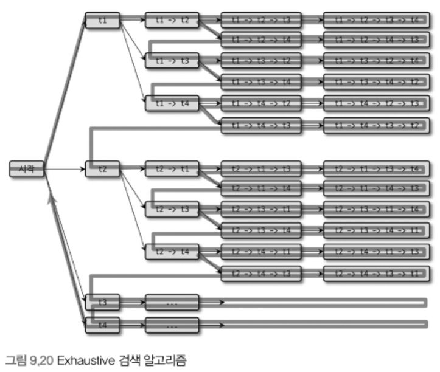
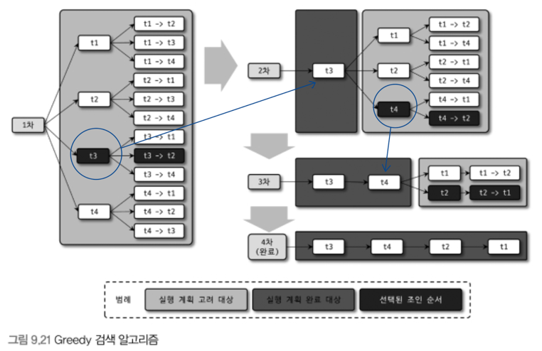

# 9.3.2 조인 최적화 알고리즘

## Exhaustive 검색 알고리즘

- MySQL 5.0-
- `FROM` 절에 명시된 모든 테이블의 조합에 대해 실행 계획의 비용을 계산해서 최적의 조합 1개를 찾는 방법
 
- 테이블 `N`개 → 조합 개수 `N!`

## Greedy 검색 알고리즘

- MySQL 5.0 도입
- `optimizer_search_depth` 시스템 변수에 따라 점진적 최적화
    - default 62
  
    

    1. optimizer_search_depth 개수 테이블의 조인 조합 중에서 최소 비용의 실행 계획 선택
    2. 선택한 실행 계획의 첫 번째 테이블을 실행 계획 완료 대상으로 선정
    3. 선정한 테이블 제외 후 1번으로 돌아가 반복

1. **optimizer_search_depth**
    - Greedy 검색 알고리즘과 Exhaustive 검색 알고리즘 중에서 어떤 알고리즘을 사용할지 결정
        - 0 - 62까지의 정수값
        - 0으로 설정하면 Greedy 검색을 위한 최적의 조인 검색 테이블 개수를 MySQL 옵티마이저가 자동으로 결정
    - 조인에 사용된 테이블의 개수가 `optimizer_search_depth`보다
        - 크다면 `optimizer_search_depth`만큼의 테이블은 Exhaustive 검색, 나머지는 Greedy 검색 사용
        - 작다면 Exhaustive 검색만 사용
    - `optimizer_search_depth` 4 - 5 정도 추천
2. **optimizer_prune_level**
    - MySQL 5.0 부터 추가된 Heuristic 검색이 작동하는 방식 제어
    - 조인 순서의 비용을 계산하는 도중 이미 계산했던 조인 순서의 비용보다 큰 경우 중단
    - `0` : Heuristic 비활성화 ← 비추천
